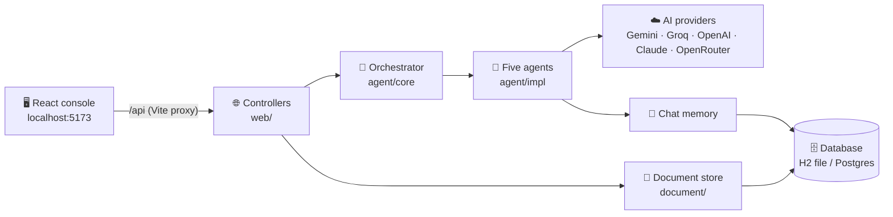
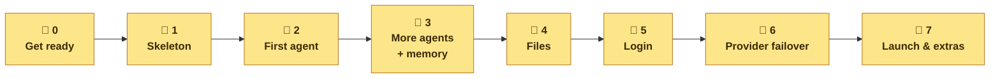
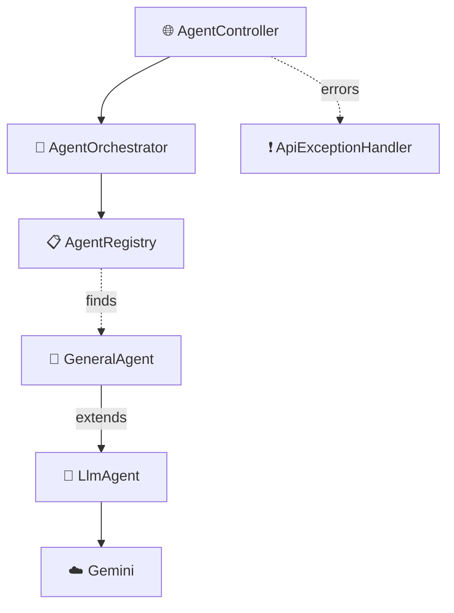
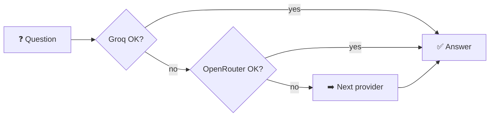
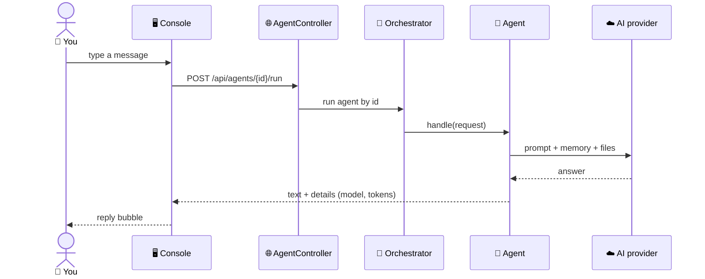

<div align="center">


# ⚙️ Backend Roadmap

**Build the Spring Boot backend for the Multi-Agent AI console — step by step, from an empty folder.**

[](#-start-from-zero)
[](#-start-from-zero)
[](#-phase-2--first-agent)
[](#-start-from-zero)
[](#-roadmap-at-a-glance)

</div>

> [!CAUTION]
> **Do this first: replace the leaked Gemini key.** A real key was committed in `eebf0a8` and is
> still in the GitHub history. Revoke it in Google AI Studio and create a new one. From now on,
> keys live only in `Backend/.env`, which git ignores — never in `application.properties`.

---

## 🗺️ The big picture

The frontend is finished. It calls the backend at `localhost:8080` and shows **simulated** replies
until the backend exists.



---

## 🧭 Roadmap at a glance



| Phase | What you get | What the console shows | Status |
|---|---|---|---|
| 🧹 **0 · Get ready** | New key, tools installed | — | 🔴 |
| 🧱 **1 · Skeleton** | An empty app running on port 8080 | Still simulated | 🔴 |
| 🤖 **2 · First agent** | Real replies from one agent | **Backend online** | 🔴 |
| 🧠 **3 · More agents + memory** | Four agents that remember the chat | Agents page filled in | 🔴 |
| 📎 **4 · Files** | PDF attachments; data survives a restart | Paperclip works | 🔴 |
| 🔐 **5 · Login** | Only signed-in users get in | Real login | 🔴 |
| 🔁 **6 · Provider failover** | The next AI provider takes over when one fails | Settings shows the chain | 🔴 |
| 🚀 **7 · Launch & extras** | Streaming, Docker, automatic checks | Word-by-word replies | 🔴 |

🔴 not started &nbsp;·&nbsp; 🟡 in progress &nbsp;·&nbsp; 🟢 done

---

## 🏁 Start from zero

Phases 0 and 1: from an empty folder to a running app.

### 🧹 Step 0 — Get ready

- ☕ **Java 25** — check with `java -version`
- 🧰 **An IDE** — IntelliJ IDEA, or VS Code with the Java extensions
- 🔑 **Your new Gemini key** — free at [aistudio.google.com/apikey](https://aistudio.google.com/apikey)

### 📦 Step 1 — Generate the project

Open **[start.spring.io](https://start.spring.io)** and choose:

| Setting | Value |
|---|---|
| Project | Maven |
| Language | Java |
| Spring Boot | 4.1.x |
| Group | `com.project` |
| Artifact | `multi-agent-ai-platform` |
| Package name | `com.project.multi_agent_ai_platform` |
| Java | 25 |
| Dependencies | **Spring Web**, **Validation**, **Spring Boot Actuator** |

Click **Generate**, unzip, rename the folder to **`Backend`**, and put it at the repo root next to
`Frontend/`.

> ⚠️ Don't add **Spring Security** yet. Without a security config it locks every endpoint. It
> comes in Phase 5.

### 📁 Step 2 — Create the folders

```text
Backend/src/main/java/com/project/multi_agent_ai_platform/
├── agent/
│   ├── core/    🧩 contracts: Agent, registry, orchestrator
│   ├── llm/     🧠 base class that talks to the AI model
│   └── impl/    🤖 the five agents
├── document/    📎 uploads, text extraction, storage
├── config/      ⚙️ settings, providers, security
└── web/         🌐 REST controllers and the error handler
    └── dto/     📦 JSON request/response records
```

```powershell
# Windows PowerShell
cd Backend\src\main\java\com\project\multi_agent_ai_platform
"agent\core","agent\llm","agent\impl","document","config","web\dto" | ForEach-Object { New-Item -ItemType Directory -Force $_ | Out-Null }
```

```bash
# macOS / Linux
cd Backend/src/main/java/com/project/multi_agent_ai_platform
mkdir -p agent/core agent/llm agent/impl document config web/dto
```

### ⚙️ Step 3 — Settings and secrets

Replace `Backend/src/main/resources/application.properties` with:

```properties
spring.application.name=multi-agent-ai-platform
server.port=8080
# This machine only, until login exists (Phase 5)
server.address=127.0.0.1
# Read keys from Backend/.env, which git ignores
spring.config.import=optional:file:.env[.properties]
# Errors as problem+json - the console shows their "detail" text
spring.mvc.problemdetails.enabled=true
management.endpoints.web.exposure.include=health
```

Create **`Backend/.env`** (your real key, never committed) and **`Backend/.env.example`** (the same
names, empty values, committed):

```properties
GEMINI_API_KEY=
```

Add `!.env.example` to the root `.gitignore`. Its `.env.*` rule would hide the example file
otherwise.

### ▶️ Step 4 — First run

```bash
cd Backend
./mvnw spring-boot:run          # Windows: .\mvnw spring-boot:run
```

✅ **Phase 1 is done when** <http://localhost:5173/actuator/health> — through the frontend's proxy —
shows `{"status":"UP"}`.

---

## 🛠️ Build it up, phase by phase

Each phase lists the files to create, in order.

### 🤖 Phase 2 — First agent

**Goal:** one real agent answering in the console.

➕ Add to `pom.xml`: the Spring AI BOM `2.0.1` and `spring-ai-starter-model-google-genai`. Then
add to `application.properties`:

```properties
spring.ai.google.genai.api-key=${GEMINI_API_KEY:missing-api-key}
spring.ai.google.genai.chat.options.model=${GEMINI_MODEL:gemini-3.5-flash-lite}
# Switch off model types we don't use
spring.ai.model.embedding=none
```

| # | File | Folder | Job |
|---|---|---|---|
| 1 | `AgentRequest.java` | `agent/core` | What the user sent: conversation id, message, options |
| 2 | `AgentResponse.java` | `agent/core` | What the agent answers: text and details |
| 3 | `AgentParameter.java` | `agent/core` | Describes one option (`STRING`, `NUMBER` or `SELECT`) |
| 4 | `Agent.java` | `agent/core` | The interface every agent implements |
| 5 | `AgentRegistry.java` | `agent/core` | Finds every agent at startup |
| 6 | `AgentOrchestrator.java` | `agent/core` | Runs an agent by its id |
| 7 | `UnknownAgentException.java` | `agent/core` | Wrong id → `404` |
| 8 | `LlmAgent.java` | `agent/llm` | Base class: system prompt + AI call |
| 9 | `GeneralAgent.java` | `agent/impl` | The first real agent |
| 10 | `AiConfig.java`, `LlmProvider.java` | `config` | AI model and provider details |
| 11 | `AgentSummary`, `RunAgentRequest`, `RunAgentResponse`, `PlatformStatus` | `web/dto` | JSON shapes |
| 12 | `AgentController.java` | `web` | `GET /api/agents`, `POST /api/agents/{id}/run` |
| 13 | `PlatformController.java` | `web` | `GET /api/platform` (document counts stay `0` until Phase 4) |
| 14 | `ApiExceptionHandler.java` | `web` | Turns every error into problem+json |

How these files connect:



✅ **Done when** the sidebar badge says **Backend online** and the General Assistant gives a real
answer, with no *simulated* tag.

### 🧠 Phase 3 — More agents + memory

**Goal:** the specialist agents, and chats that remember earlier messages.

| File | Folder | Job |
|---|---|---|
| `CodingAgent.java` | `agent/impl` | Code first, then a short explanation; `language` option |
| `ResearchAgent.java` | `agent/impl` | Findings, open questions, confidence |
| `SummarizerAgent.java` | `agent/impl` | `style` and `maxWords` options |
| `PlatformProperties.java` | `config` | `platform.*` settings, e.g. the memory size |
| `ConversationController.java` | `web` | `DELETE /api/conversations/{id}` |

Also add a chat memory bean to `AiConfig`, keeping the last 20 messages of each conversation.

✅ **Done when** the Agents page shows four agents with their options, and a follow-up question
remembers the one before it.

### 📎 Phase 4 — Files

**Goal:** attach PDFs and text files, and keep data after a restart.

➕ Add to `pom.xml`: `spring-boot-starter-jdbc`, `h2`, `spring-ai-pdf-document-reader`,
`spring-ai-starter-model-chat-memory-repository-jdbc`.

| File | Folder | Job |
|---|---|---|
| `schema.sql` | `resources` | The documents table |
| `StoredDocument.java`, `DocumentStore.java` | `document` | The document record and the store interface |
| `JdbcDocumentStore.java` | `document` | Saves uploads to the H2 file |
| `DocumentTextExtractor.java` | `document` | PDF or text file → plain text |
| `AttachmentResolver.java` | `document` | Adds attached files to the AI prompt |
| `DocumentNotFoundException`, `UnsupportedDocumentException` | `document` | → `404` / `415` |
| `StorageConfig.java` | `config` | Chooses the store |
| `DocumentSummary.java` | `web/dto` | JSON shape |
| `DocumentController.java` | `web` | `POST /api/documents`, `DELETE /api/documents/{id}` |
| `DocumentAgent.java` | `agent/impl` | Answers only from attached files |

Add `data/` to `Backend/.gitignore`; the H2 database file lives there.

✅ **Done when** the answer to a question about an attached PDF quotes it, and the file is still
there after restarting the backend.

### 🔐 Phase 5 — Login

**Goal:** only signed-in users can use the console and the API.

➕ Add to `pom.xml`: `spring-boot-starter-security`.

| File | Folder | Job |
|---|---|---|
| `SecurityConfig.java` | `config` | Every route needs a session, except login |
| `AuthController.java` | `web` | `POST /api/auth/login`, `POST /api/auth/logout`, `GET /api/auth/me` |
| `LoginRequest.java`, `AuthResponse.java` | `web/dto` | JSON shapes |

🖥️ **Frontend:** replace the `TODO` in `App.tsx` with the real login call, and bring back
`useAuth.ts` from history.

✅ **Done when** `/api/agents` returns `401` before signing in and everything works after.

### 🔁 Phase 6 — Provider failover

**Goal:** if one AI provider fails, the next one answers.

➕ Add to `pom.xml`: the OpenAI and Anthropic starters. Groq and OpenRouter also use the OpenAI
starter, pointed at their own address.



| File | Folder | Job |
|---|---|---|
| `ProviderChain.java` | `config` | Providers that have a key, in order; tries the next on failure |
| `ProviderStatus.java` | `web/dto` | One entry of the chain |
| Update `PlatformStatus`, `LlmAgent` | — | Adds `providers[]` and `metadata.provider` |

The order comes from one setting: `AI_PROVIDERS=groq,openrouter,google-genai,openai,anthropic`.

✅ **Done when** Settings lists the chain, and with a broken first key the next provider answers
and the Inspector names it.

### 🚀 Phase 7 — Launch & extras

- 🌊 **Streaming** — replies appear word by word: `POST /api/agents/{id}/stream`
- 🧭 **Auto-pick** the right agent · 🌐 **web search** for the Research Agent
- 👥 **Accounts in the database** — sign-up, password reset, Google sign-in
- 🐳 **Docker** — `Dockerfile` and `compose.yaml` with Postgres
- 🔒 **HTTPS** and rate limits
- 🤖 **CI** — `.github/workflows/ci.yml` runs the tests and the frontend build on every push

---

## 📁 Final folder structure

The number after each item is the phase that creates it.

```text
Multi-Agent-AI-Platform/
├── Frontend/                                    ✅ done
└── Backend/                                     🧱 1
    ├── pom.xml                                  🧱 1  (more dependencies in 2, 4, 5, 6)
    ├── mvnw · mvnw.cmd · .mvn/                  🧱 1  (from Spring Initializr)
    ├── .env                                     🧱 1  🔑 your keys — never committed
    ├── .env.example                             🧱 1
    ├── data/                                    📎 4  H2 database file (ignored)
    └── src/
        ├── main/java/com/project/multi_agent_ai_platform/
        │   ├── MultiAgentAiPlatformApplication.java       🧱 1
        │   ├── agent/core/    Agent · AgentRegistry · AgentOrchestrator …   🤖 2
        │   ├── agent/llm/     LlmAgent                                      🤖 2
        │   ├── agent/impl/    General 🤖 2 · Coding · Research · Summarizer 🧠 3 · Document 📎 4
        │   ├── document/      DocumentStore · JdbcDocumentStore …           📎 4
        │   ├── config/        AiConfig 🤖 2 · StorageConfig 📎 4 · SecurityConfig 🔐 5 · ProviderChain 🔁 6
        │   └── web/           AgentController 🤖 2 · DocumentController 📎 4 · AuthController 🔐 5
        │       └── dto/       one record per JSON shape
        ├── main/resources/
        │   ├── application.properties           🧱 1
        │   └── schema.sql                       📎 4
        └── test/java/…                          🧪 tests for every phase
```

---

## 🔄 How one message flows



---

## 🔌 API the console needs

| Phase | Method | Path | Used for |
|---|---|---|---|
| 🤖 2 | `GET` | `/api/agents` | Agent list — also the "Backend online" check |
| 🤖 2 | `POST` | `/api/agents/{id}/run` | Send a message |
| 🤖 2 | `GET` | `/api/platform` | Provider, model and limits in Settings |
| 🧠 3 | `DELETE` | `/api/conversations/{id}` | Forget a chat |
| 📎 4 | `POST` · `DELETE` | `/api/documents` · `/api/documents/{id}` | Attach or remove a file |
| 🔐 5 | `POST` · `POST` · `GET` | `/api/auth/login` · `/logout` · `/me` | Sign in and out |
| 🚀 7 | `POST` | `/api/agents/{id}/stream` | Word-by-word replies |

The JSON field names must match [`Frontend/src/types.ts`](Frontend/src/types.ts) exactly.

---

## ⭐ Golden rules

1. 🔑 **Keys only in `.env`** or environment variables — never in `application.properties`.
2. ❗ **Every error is problem+json** with a `detail` text. The console shows that text; a server
   error without it looks like "backend offline".
3. 🧩 **Keep the JSON names** the frontend expects (`Frontend/src/types.ts`).
4. 🩺 **Keep `GET /api/agents` fast.** The console uses it as its health check.
5. 🧪 **Test twice:** with a fake AI model in the tests, then for real in the console.

---

## 🆘 Stuck?

The old backend is still in git history. Look at any file without restoring it:

```bash
git show fb901ac^:Backend/src/main/java/com/project/multi_agent_ai_platform/agent/llm/LlmAgent.java
git show 434d0ed^:Backend/src/main/java/com/project/multi_agent_ai_platform/config/SecurityConfig.java
git show 434d0ed^:Frontend/src/hooks/useAuth.ts
```

> ⚠️ Don't copy the old `application.properties` — it contains the leaked key.

<div align="center">
<sub>🧭 Roadmap for <code>Backend/</code> · see <a href="PROGRESS.md">PROGRESS.md</a> for project history and <a href="README.md">README.md</a> for how to run it</sub>
</div>
