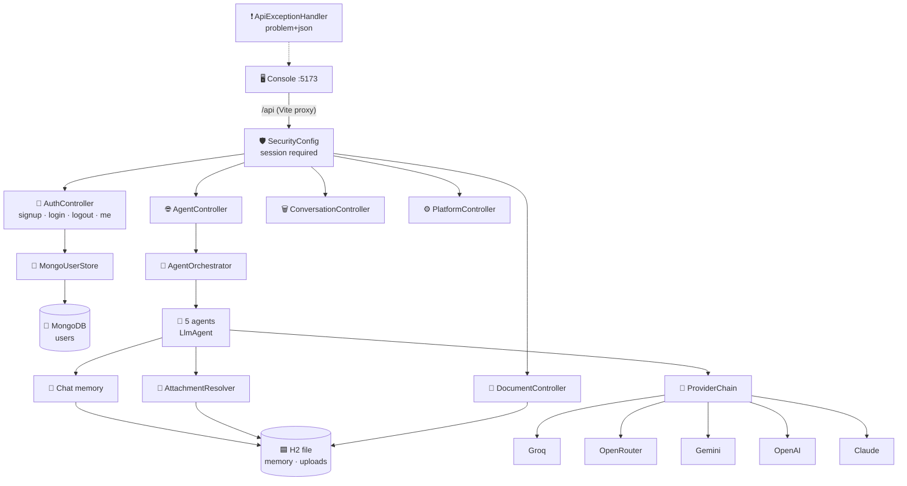
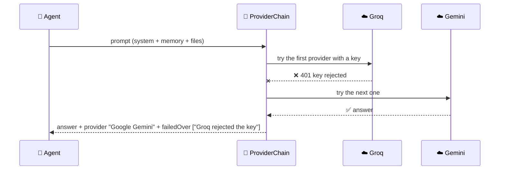
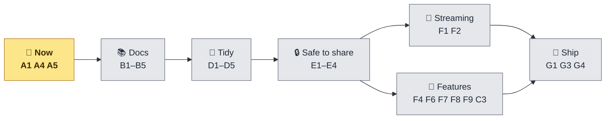

<div align="center">


# ⚙️ Backend — Work Done & Remaining

**The Spring Boot API: what is built, step by step, and what is left — cut into small pieces.**

[](Backend/pom.xml)
[](Backend/pom.xml)
[](Backend/pom.xml)
[](#-checks)
[](#-where-data-lives)
[](#-where-data-lives)

</div>

> 📅 Checked against the code on **10 October 2026**. The frontend side is in
> [`FRONTEND_STATUS.md`](FRONTEND_STATUS.md); the whole project's to-do list is in [`TASKS.md`](TASKS.md#-to-do-list) —
> the IDs below (**D1**, **F1**…) are the same.

---

## 🧭 At a glance

| | |
|---|---|
| 🤖 **Agents** | 5 — General · Coding · Research · Summarizer · Document |
| ☁️ **AI providers** | 5 with automatic failover — Groq → OpenRouter → Gemini → OpenAI → Claude (order from `AI_PROVIDERS`) |
| 🔌 **Endpoints** | 11 under `/api` + `/actuator/health` |
| 🔐 **Login** | Session cookie · sign-up and accounts in **MongoDB** · BCrypt passwords |
| 🗄️ **Storage** | Uploads + chat memory in an **H2 file** (`Backend/data/`) · accounts in **MongoDB** |
| 🧪 **Tests** | 136 passing (no AI key or network needed; account tests need MongoDB running) |
| ✅ **Done** | Phases 0–6 + MongoDB accounts — [Work done](#-work-done--step-by-step) |
| 🧩 **Left** | 28 small pieces — [Remaining work](#-remaining-work--small-pieces) |
| 💾 **Git** | 🟢 Everything pushed — accounts `bbc501c` · sign-up `44b3856` |

---

## 🏗️ How the backend is built



How one agent call fails over:



---

## ✅ Work done — step by step

### 🧹 Phase 0 — Get ready

- ✅ Java 25, Node 24, VS Code Java + Spring extensions
- ✅ A new Gemini key in `Backend/.env` (git-ignored) — ⚠️ the two **old leaked keys still need revoking** (**A1**)

### 🧱 Phase 1 — Skeleton *(`419fea2`)*

- ✅ Spring Boot 4.1.1 on Java 25 · port 8080 on `127.0.0.1` only
- ✅ Keys read from `Backend/.env` · every error as problem+json · `/actuator/health`
- ✅ Checked: health `UP` through the frontend's proxy

### 🤖 Phase 2 — First agent *(`89279fa` · `57d59ef` · `f238c88`)*

- ✅ Agent core: `Agent`, `AgentRegistry` (finds every agent bean), `AgentOrchestrator`
- ✅ `LlmAgent` base class: system prompt → model; reports provider, model, tokens, finish reason
- ✅ `GeneralAgent` · `GET /api/agents` · `POST /api/agents/{id}/run` · `GET /api/platform`
- ✅ `ApiExceptionHandler`: a wrong key → `502` with *"set GEMINI_API_KEY"*; rate limit → `503`
- ✅ Checked: a real Gemini answer in 1.6 s

### 🧠 Phase 3 — More agents + memory *(`ce9b0f9` · `6ea75a3` · `a7a1660`)*

- ✅ `CodingAgent` (language option) · `ResearchAgent` (confidence) · `SummarizerAgent` (style, max words)
- ✅ Chat memory: the last 20 messages per conversation; a failed call leaves no unanswered question behind
- ✅ `DELETE /api/conversations/{id}` forgets a chat
- ✅ Fixed on the way: *"Confidence: medium, not high"* used to read as **high**

### 📎 Phase 4 — Files *(`d41a0b6` · `7b44671` · `633fcd0`)*

- ✅ H2 database file: uploads and chat memory **survive a restart**, nothing to install
- ✅ `POST /api/documents` (PDF page by page, text and code files) · `DELETE /api/documents/{id}`
- ✅ **Every** agent reads attached files (60 000-char budget shared between them); `DocumentAgent` answers only from them
- ✅ Summarizer summarises the attached file, not the short message
- ✅ Checked: a page-quoting answer from a PDF, and the same file still there after a restart

### 🔐 Phase 5 — Login *(`12880ad`)*

- ✅ Every `/api` route needs a session except sign-up, login and logout
- ✅ New session id on login (session fixation) · cookie `HttpOnly; SameSite=Strict` · 8 h timeout
- ✅ A wrong username and a wrong password get the same `401` message

### 🔁 Phase 6 — Provider failover *(`6440093`)*

- ✅ `ProviderChain`: five providers, the ones with a key tried in `AI_PROVIDERS` order
- ✅ `ProviderFailure` reads every SDK's errors (Gemini, OpenAI — also for Groq/OpenRouter — and Anthropic)
- ✅ Fast failover: one retry per provider, 60 s timeout · all failed → one message listing each
- ✅ Fixed on the way: an empty key in `.env` used to stop the backend from starting
- ✅ Checked: a fake Groq key → Gemini answered, and the reply named both

### 🍃 Step 7 — Accounts in MongoDB *(Oct 10, `bbc501c` · `44b3856`)*

- ✅ `user/` package: `UserAccount`, `UserStore`, `MongoUserStore`, `UserDocument`, `UserRepository`,
  `DatabaseUserDetailsService`, `UsernameTakenException`
- ✅ `POST /api/auth/signup` → `201` and signed in · taken name → `409` · bad input → `400` naming the field
- ✅ Unique index on `username`, created at startup · passwords stored as BCrypt hashes
- ✅ `AUTH_USERS` removed everywhere
- ✅ Checked with MongoDB 8.3: sign-up, `409`, `400`, login, wrong password, **restart → still logs in**
- 📖 How it was built, step by step: [`DATABASE.md`](DATABASE.md)

---

## 🔌 The API

| Method | Path | Needs a session | Answers |
|---|---|---|---|
| `POST` | `/api/auth/signup` | ❌ | `201` `{username}` · `409` taken · `400` invalid |
| `POST` | `/api/auth/login` | ❌ | `200` `{username}` · `401` |
| `POST` | `/api/auth/logout` | ❌ | `204` |
| `GET` | `/api/auth/me` | ✅ | `200` `{username}` · `401` |
| `GET` | `/api/agents` · `/api/agents/{id}` | ✅ | agent list / one agent |
| `POST` | `/api/agents/{id}/run` | ✅ | reply + metadata + `conversationId` + `elapsedMs` |
| `GET` | `/api/platform` | ✅ | provider chain, model, limits |
| `POST` | `/api/documents` | ✅ | `201` summary · `415` unsupported · `413` too large |
| `DELETE` | `/api/documents/{id}` · `/api/conversations/{id}` | ✅ | `204` |
| `GET` | `/actuator/health` | ❌ | `{"status":"UP"}` |

### 🗄️ Where data lives

| Data | Where | Survives a restart |
|---|---|---|
| 📎 Uploads (`platform_documents`) | H2 file `Backend/data/platform.mv.db` | ✅ |
| 🧠 Chat memory (`SPRING_AI_CHAT_MEMORY`) | the same H2 file | ✅ |
| 👥 Accounts (`users`) | MongoDB `agents` (tests: `agents_test`) | ✅ |
| 🔐 Sessions | memory | ❌ — a restart signs everyone out |

### 🔑 Settings in `Backend/.env`

| Key | What for |
|---|---|
| `GEMINI_API_KEY` · `GROQ_API_KEY` · `OPENROUTER_API_KEY` · `OPENAI_API_KEY` · `ANTHROPIC_API_KEY` | AI providers — set at least one |
| `AI_PROVIDERS` | failover order (empty = `groq,openrouter,google-genai,openai,anthropic`) |
| `GEMINI_MODEL` · `GROQ_MODEL` · `OPENROUTER_MODEL` · `OPENAI_MODEL` · `ANTHROPIC_MODEL` | change a model |
| `MONGODB_URI` | accounts database (default `mongodb://localhost:27017/agents`) |
| `SPRING_DATASOURCE_URL` / `_USERNAME` / `_PASSWORD` | a different SQL database instead of the H2 file |

### 📁 What's where

```text
Backend/src/main/java/com/project/multi_agent_ai_platform/
├── agent/core/    🧩 Agent · AgentRegistry · AgentOrchestrator · requests, responses, errors
├── agent/llm/     🧠 LlmAgent — prompt, memory, files, provider facts
├── agent/impl/    🤖 General · Coding · Research · Summarizer · Document
├── config/        ⚙️ AiConfig · ProviderChain · ProviderFailure · SecurityConfig · settings records
├── document/      📎 JdbcDocumentStore · DocumentTextExtractor · AttachmentResolver
├── user/          👥 MongoUserStore · DatabaseUserDetailsService · UserDocument · …
└── web/           🌐 5 controllers · ApiExceptionHandler · dto/ (JSON records)
Backend/src/main/resources/   application.properties · schema.sql
```

### 🧪 Checks

| Check | Result |
|---|---|
| `.\mvnw test` | 🟢 **136 passing** in 26 test classes |
| Without a key or network | 🟢 agents run against a stub model; provider errors are built in the tests |
| Needs MongoDB running | `AuthIntegrationTest`, `MongoUserStoreTest` (database `agents_test`) |
| Real runs (not just tests) | 🟢 every phase was checked against a running server, through the frontend's proxy |

---

## 🧩 Remaining work — small pieces

> **Size:** 🟢 under 30 min · 🟡 1–2 hours · 🔴 half a day &nbsp;·&nbsp; **Who:** 👤 you · 🤖 me (Claude) · 👥 together
> A 🟡 or 🔴 piece is split into numbered steps — each step is one small change you can check on its own.



### 🏁 Now

- [ ] **A1** 🔑 Revoke the leaked Gemini keys `…Egng` and `…5i5w` in [AI Studio](https://aistudio.google.com/apikey) — 👤 🟢
- [x] **A3** 💾 Committed and pushed: `bbc501c` accounts in MongoDB · `44b3856` sign-up endpoint — 🤖 🟢
- [ ] **A4** 🧹 Delete the local branch `backup-before-scrub` (holds both leaked keys) — after **A1** — 🤖 🟢
- [ ] **A5** 🌿 Delete the old branch `phase-2/foundation`, local and on GitHub — 🤖 🟢

### 📚 Docs

- [ ] **B1** 📖 `README.md`: how to run the backend — MongoDB, `Backend/.env`, `.\mvnw spring-boot:run` — 🤖 🟢
- [ ] **B2** 🔐 `README.md`: sign-up and login; rewrite the Security notes — 🤖 🟢
- [ ] **B3** 🏷️ `README.md`: status note, badge, diagram, footer, troubleshooting — 🤖 🟢
- [ ] **B4** 🔗 Remove the dead links to `PROGRESS.md` and `FRONTEND_BUG_AUDIT.md` — 🤖 🟢
- [ ] **B5** 🗺️ `BACKEND.md`: mark Phases 0–6 done (it still says *Not started*) — 🤖 🟢

### 🧹 D · Tidy up

- [ ] **D1** 📏 The `413` says *"The file is larger than 20 MB"* — `ApiExceptionHandler` — 🤖 🟢
- [ ] **D2** 🌶️ Remove Lombok (unused; Java 25 warnings, VS Code errors) — `pom.xml` — 🤖 🟢
- [ ] **D3** 🧾 Fill in or remove the empty `<name/>`, `<description/>`, `<licenses>`, `<developers>`, `<scm>` — `pom.xml` — 🤖 🟢
- [ ] **D4** 🗑️ Delete the stray `target/` folder at the repo root — 🤖 🟢
- [ ] **D5** 🐘 *(optional)* One run on a real PostgreSQL via `SPRING_DATASOURCE_URL` — 👥 🟡
  1. Install PostgreSQL, create the database `agents`
  2. Add the `org.postgresql:postgresql` driver to `pom.xml`
  3. Set the three `SPRING_DATASOURCE_*` keys in `.env`, start, upload a file, restart, check it's still there

### 🔒 E · Safe to share — before anyone but you can reach it

- [ ] **E1** 🎟️ Sign-up needs an **invite code**, so strangers can't spend your AI credits — 🤖 🟡
  1. `platform.signup.code=${SIGNUP_CODE:}` setting (empty = sign-up open, as today)
  2. `SignupRequest`: an optional `code` field
  3. `AuthController.signup`: a wrong or missing code → `403` problem+json
  4. Tests: no code / wrong code / right code · then the frontend field (**E1**, UI half)
- [ ] **E2** 🧱 **Rate limits** on login and sign-up — 🤖 🟡
  1. A small counter per IP (e.g. 5 tries a minute) in a servlet filter on `/api/auth/*`
  2. Over the limit → `429` problem+json with *"Too many attempts, wait a minute"*
  3. Tests: the 6th try in a minute is refused, the next minute works
- [ ] **E3** 🔐 **HTTPS** + `Secure` cookie — 👥 🟡
  1. Pick how it's served: a reverse proxy with TLS (with **G3**) or Spring's own `server.ssl.*`
  2. `server.servlet.session.cookie.secure=true` and `server.forward-headers-strategy=framework`
  3. Check: the cookie shows `Secure` and login works over `https://`
- [ ] **E4** 🌍 Only then accept other machines: change `server.address=127.0.0.1` — 👥 🟢

### 🌊 F · New features

- [ ] **F1** 🌊 **Streaming** endpoint — 🤖 🟡
  1. `POST /api/agents/{id}/stream` returning server-sent events (`text/event-stream`)
  2. `LlmAgent`: a `stream(...)` twin of `complete(...)` using `ChatClient … .stream()` (memory and files included)
  3. Events: one per chunk of text, then a last one with metadata (provider, model, tokens)
  4. Tests with a streaming stub model
- [ ] **F2** 🔁 Streaming **with failover** — 🤖 🟡
  1. `ProviderChain.stream(...)`: try the next provider if one fails **before** the first chunk
  2. A failure after the first chunk ends the stream with an error event (no mixing of two answers)
  3. Tests: first provider fails at once → second streams; fails mid-way → error event
- [ ] **F4** 🧭 **Auto-pick** the agent — 🤖 🟡
  1. A small router: one cheap model call that answers with an agent id from the registry
  2. `POST /api/agents/auto/run`: route, then run that agent; the reply's metadata says which was picked
  3. Unclear message or router failure → General Assistant
  4. Tests with a stub router · then the frontend's **F5**
- [ ] **F6** 🌐 **Web search** for the Research Agent — 👥 🔴
  1. Choose a search API (e.g. Tavily or Brave) and add its key to `.env`
  2. A `WebSearch` service: top results as title + link + snippet
  3. `ResearchAgent`: search first, then answer from the results and **list the links it used**
  4. Without a search key: today's knowledge-only mode, saying so
  5. Tests with a fake search service
- [ ] **F7** 🔑 **Password reset** — 🤖 🟡
  1. `POST /api/auth/password` — change your own password (old + new) while signed in
  2. An admin route to set a new password for an account (role `ADMIN`)
  3. Tests · then the frontend's **F7** (UI half)
- [ ] **F8** 🇬 **Google sign-in** — 👥 🔴
  1. A Google Cloud OAuth client; its id and secret in `.env`
  2. `spring-boot-starter-oauth2-client` and an OAuth login in `SecurityConfig`
  3. First Google login creates (or links) a MongoDB account
  4. Back to the console with a normal session · then the frontend's **F8**
- [ ] **F9** 💰 **Token totals** per conversation — 🤖 🟡
  1. Save each reply's token counts with the conversation
  2. `GET /api/conversations/{id}/usage` · then the frontend's **F9**
- [ ] **C3** ✏️ *(backend half)* Rewind a conversation's memory — 🤖 🟢
  1. `POST /api/conversations/{id}/rewind` `{keep: N}` keeps only the first *N* messages · then the frontend's **C3**

### 🐳 G · Ship it

- [ ] **G1** 🐳 Backend `Dockerfile` — 🤖 🟢
  1. Build stage: `./mvnw package -DskipTests` · run stage: a JRE 25 image with the jar
- [ ] **G3** 🧩 `compose.yaml` — 🤖 🟡
  1. Services: backend, frontend (**G2**), MongoDB
  2. Volumes: `Backend/data` (H2) and MongoDB's data
  3. Keys from `.env`, never written into the file
- [ ] **G4** 🤖 *(backend half)* CI: `.github/workflows/ci.yml` runs `./mvnw test` with a MongoDB service container on every push — 🤖 🟡

---

<div align="center">
<sub>⚙️ Backend status · <a href="FRONTEND_STATUS.md">FRONTEND_STATUS.md</a> for the frontend · <a href="TASKS.md">TASKS.md</a> for the whole to-do list · <a href="BACKEND.md">BACKEND.md</a> · <a href="DATABASE.md">DATABASE.md</a></sub>
</div>
