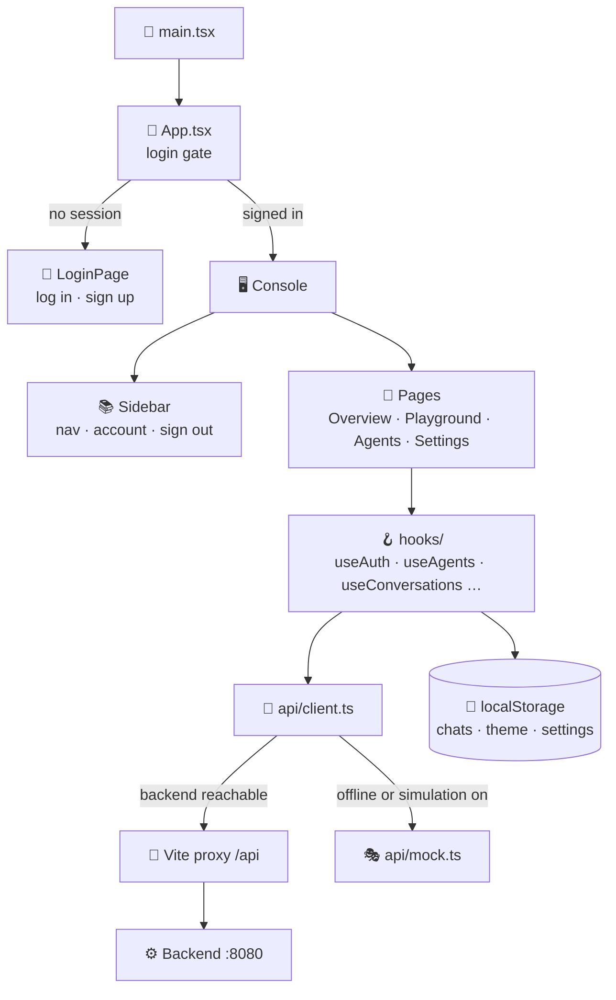
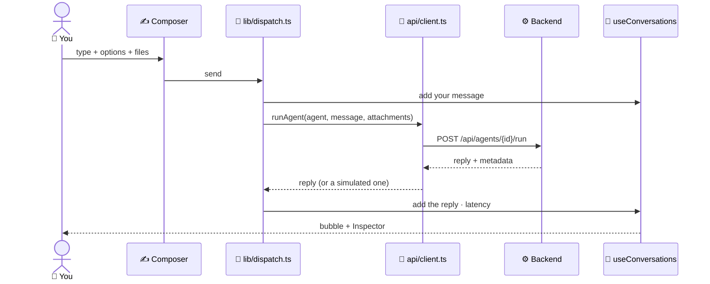
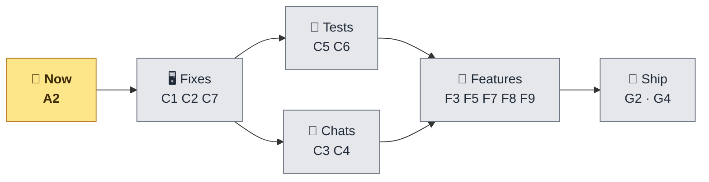

<div align="center">


# 🖥️ Frontend — Work Done & Remaining

**The React console: what is built, step by step, and what is left — cut into small pieces.**

[](Frontend/package.json)
[](Frontend/tsconfig.app.json)
[](Frontend/vite.config.ts)
[](#-at-a-glance)
[](#-checks)
[](#-c--frontend-fixes)

</div>

> 📅 Checked against the code on **10 October 2026**. The backend side is in
> [`BACKEND_STATUS.md`](BACKEND_STATUS.md); the whole project's to-do list is in [`TASKS.md`](TASKS.md#-to-do-list) —
> the IDs below (**C1**, **F3**…) are the same.

---

## 🧭 At a glance

| | |
|---|---|
| 🧱 **Built with** | React 19 · TypeScript 6 (strict) · Vite 8 — **no UI kit, no state library, no router library** |
| 📄 **Pages** | 🔐 Login / sign-up · 🏠 Overview · 💬 Playground · 🤖 Agents · ⚙️ Settings |
| 🔌 **Talks to** | The Spring Boot backend through Vite's `/api` proxy — or a built-in **simulation** when it can't |
| 💾 **Keeps in the browser** | Chats, theme, settings (`localStorage`, keys starting with `maap.`) |
| ✅ **Done** | 9 steps — everything below in [Work done](#-work-done--step-by-step) |
| 🧩 **Left** | 18 small pieces — see [Remaining work](#-remaining-work--small-pieces) |
| 💾 **Git** | 🟢 Everything pushed — the sign-up form is `087a3e6` |

---

## 🏗️ How the frontend is built



How one message travels:



---

## ✅ Work done — step by step

### 📦 Step 1 — Scaffold *(Sep 18)*

- ✅ Vite + React 19 + TypeScript project in `Frontend/`
- ✅ TypeScript **strict mode** on (`1ee37b4`, `dd41c1c`)
- ✅ ESLint with the React 19 hooks rules

### 🧱 Step 2 — Foundation *(Sep 19)*

- ✅ First components, hooks and pure-logic libraries (`lib/`) kept separate from the UI
- ✅ Four pages — Overview, Playground, Agents, Settings
- ✅ Sidebar + **hash routing** (`#/`, `#/playground/{id}`, `#/agents`, `#/settings`) without a router library

### 🔌 Step 3 — Wired to a backend *(Sep 19–20)*

- ✅ `types.ts` mirrors the backend's JSON exactly (`AgentInfo`, `AgentRequest`, `PlatformStatus`, …)
- ✅ Design tokens: **dark and light theme**
- ✅ `api/client.ts` — one `fetch` wrapper; every error read as RFC 9457 problem+json
- ✅ **Simulation mode** (`api/mock.ts`): with no backend, five fake agents answer, clearly tagged *simulated*
- ✅ Vite proxy: the browser only ever talks to `localhost:5173`, so no CORS

### 💬 Step 4 — The Playground *(Sep 20)*

- ✅ **Per-agent chat lists**; switching agent opens a fresh chat
- ✅ **Edit & resend**: change a sent message, the old reply is dropped, the agent answers again
- ✅ **Inspector**: latency, provider, model, metadata and the exact request
- ✅ **Per-agent colour**, contrast-checked
- ✅ Wide reply bubbles; code blocks with a **language chip and copy button** (own small markdown renderer)
- ✅ Coding Agent: a real **21-language dropdown**; options for every agent built from what the agent describes
- ✅ The sidebar **auto-collapses** in the Playground; responsive down to 320 px phones

### 📎 Step 5 — File attachments *(Sep 20)*

- ✅ Paperclip, **drag & drop** and **paste** to attach — for every agent
- ✅ Each file uploads at once; only its id travels with messages; files stay in context for the whole chat
- ✅ A file chip on the message that carried it

### 🚪 Step 6 — Login landing page *(Sep 22)*

- ✅ A full front page: hero with the form, About, Features, Contact
- ✅ Sticky nav that turns solid on scroll, mobile burger menu, shared dark/light theme
- ✅ *Remember me* for the username; show/hide password
- ✅ Scroll-jank fix: the blurred background is its own compositor layer

### 🔐 Step 7 — Real login *(Oct 10, `8e9f564`)*

- ✅ `hooks/useAuth.ts` — checks `GET /api/auth/me` once on load, so **a refresh keeps you signed in**
- ✅ `App.tsx` is a **gate**: the console doesn't mount (and sends nothing) until there is a session
- ✅ A `401` from **any** call sends you back to the login page
- ✅ Sidebar **account row + Sign out**; name hidden on phones
- ✅ Clear message when the backend can't be reached; *"Enter your username and password"* wording

### 🔁 Step 8 — Provider chain in Settings *(Oct 10)*

- ✅ Settings lists the backend's **failover order**, skipped providers greyed out with the key they need
- ✅ The Inspector names the provider that actually answered (`metadata.provider`)

### 📝 Step 9 — Sign-up form *(Oct 10, `087a3e6`)*

- ✅ The login page switches between **Log in** and **Create your account**
- ✅ The sign-up rules shown as a hint, and checked **before** sending (3–50 chars `A–Z a–z 0–9 . _ -`; 8+ char password)
- ✅ `autocomplete="new-password"` in sign-up mode; the old "no self-service sign-up" notice is gone
- ✅ `signup()` in `api/client.ts` and `useAuth` — you are signed in straight after

---

## 📁 What's where

```text
Frontend/src/
├── main.tsx               🚀 starts React (StrictMode)
├── App.tsx                🔐 login gate + the console shell + banners
├── types.ts               🧾 the JSON shapes shared with the backend
├── api/
│   ├── client.ts          🔌 every backend call · auth · offline fallback · problem+json errors
│   └── mock.ts            🎭 simulated agents, replies and uploads
├── pages/
│   ├── LoginPage.tsx      🚪 landing page + log in / sign up form
│   ├── OverviewPage.tsx   🏠 getting-started checklist, stats, recent chats
│   ├── PlaygroundPage.tsx 💬 chat list · thread · composer · Inspector
│   ├── AgentsPage.tsx     🤖 a card per agent, built from its description
│   └── SettingsPage.tsx   ⚙️ API address, simulation mode, theme, provider chain, delete chats
├── components/            🧩 Composer · MessageBubble · Markdown · Inspector · Sidebar · Icons · …
├── hooks/                 🪝 useAuth · useAgents · useConversations · useAttachments · useTheme · useHashRoute · …
└── lib/                   🧠 dispatch (send/edit flow) · storage · agentColor · attributes · util
```

### 🔌 What the frontend calls

| | Call | Used for |
|---|---|---|
| 🔐 | `POST /api/auth/signup` · `/login` · `/logout` · `GET /api/auth/me` | Sign up, log in, log out, "am I signed in?" |
| 🤖 | `GET /api/agents` · `POST /api/agents/{id}/run` | Agent list (also the "Backend online" check) · send a message |
| ⚙️ | `GET /api/platform` | Provider chain, model, limits (Settings, Overview) |
| 📎 | `POST /api/documents` · `DELETE /api/documents/{id}` | Attach / remove a file |
| 🗑️ | `DELETE /api/conversations/{id}` | Forget a chat on the server when you delete it |

### 🧪 Checks

| Check | Result |
|---|---|
| `npm run lint` (ESLint, React 19 rules) | 🟢 passing |
| `npm run build` (type-check + bundle) | 🟢 passing — ~308 kB JS, ~50 kB CSS |
| Automated tests | 🔴 none yet — pieces **C5**, **C6** |

> ⚠️ **Right now in your browser:** *Simulation mode* is on (`maap.simulate = true`), so replies are simulated even
> though the backend is up. Settings → turn *Simulation mode* off → *Apply & reconnect*. The two red `401`s on
> `/api/auth/me` in the console are normal ("not signed in yet"; twice because of React's dev mode).

---

## 🧩 Remaining work — small pieces

> **Size:** 🟢 under 30 min · 🟡 1–2 hours · 🔴 half a day &nbsp;·&nbsp; **Who:** 👤 you · 🤖 me (Claude) · 👥 together
> A 🟡 or 🔴 piece is split into numbered steps — each step is one small change you can check on its own.



### 🏁 Now

- [ ] **A2** 📝 Turn *Simulation mode* off, then sign up once in the browser; note any error in the
  [errors log](TASKS.md#-setup-errors-log) — 👤 🟢
- [x] **A3** 💾 Sign-up form committed and pushed (`087a3e6`) — 🤖 🟢

### 🖥️ C · Fixes

- [ ] **C1** 🚪 A broken API address saved in the browser can't lock you out any more (it caused the login-page
  `404`): `apiBase()` ignores values that fail `isValidApiBase` — `api/client.ts` — 🤖 🟢
- [ ] **C2** 🔑 The "no API key" hints show `platform.keyEnvVar`, not a fixed `GROQ_API_KEY` —
  `App.tsx:133`, `OverviewPage.tsx:89` — 🤖 🟢
- [ ] **C7** 🎭 A simulated reply says *why*: "Simulation mode is on" when chosen, "backend is offline" only when it
  is — `api/mock.ts` — 🤖 🟢
- [ ] **C3** ✏️ Editing an earlier message also rewinds the server's memory — 🤖 🟡
  1. Backend: an endpoint that keeps only the first *N* messages of a conversation *(see the backend file)*
  2. `api/client.ts`: `rewindConversation(id, keep)`
  3. `PlaygroundPage.editMessage`: call it before resending
  4. Check: edit the 1st of 3 turns → the reply no longer mentions turns 2–3
- [ ] **C4** 💬 Chats belong to an account, not to the browser — 🤖 🟡
  1. `lib/storage.ts`: the chats key includes the username (`maap.conversations.<user>`)
  2. `useConversations`: load and save under the signed-in user
  3. One-time move: existing chats go to the first account that signs in
  4. Check: two accounts in one browser see only their own chats

### 🧪 C · Tests

- [ ] **C5** 🧪 Set up Vitest + the first tests — 🤖 🟡
  1. `npm i -D vitest jsdom` · add `"test": "vitest run"` to `package.json`
  2. `vite.config.ts`: a `test` block (`environment: 'jsdom'`)
  3. Tests for `lib/util.ts` (`formatMs`, `truncate`, `titleCase`) and `lib/attributes.ts`
  4. Tests for `lib/agentColor.ts` (same id → same colour, readable contrast)
- [ ] **C6** 🧪 Tests for `api/client.ts` — 🤖 🟡
  1. A fake `fetch` helper
  2. Offline → simulated agents and status `offline`; simulation on → no network call at all
  3. A `401` from any call tells `useAuth` to show the login page
  4. problem+json `detail` becomes the error message; an empty `502` reads "could not be reached"

### 📚 Docs

- [ ] **B6** 📝 `Frontend/README.md:175` — replace the old Spring Security note with the real login and sign-up — 🤖 🟢

### 🔒 Safe to share

- [ ] **E1** 🎟️ *(UI half)* An **invite code** field in sign-up mode, once the backend asks for one — 🤖 🟢
- [ ] **E5** 🙈 Check that no key sits in a `VITE_*` variable — every visitor can read those — 🤖 🟢

### 🌊 F · New features

- [ ] **F3** 🌊 Replies appear **word by word** — 🤖 🟡 *(after the backend's F1)*
  1. `api/client.ts`: `streamAgent()` reads the server-sent events
  2. `lib/dispatch.ts`: create the reply bubble at once, append text as it arrives
  3. A **Stop** button while it streams
  4. Fall back to `POST /run` when streaming isn't available, and in simulation mode
- [ ] **F5** 🧭 An **Auto** choice in the agent picker — the backend picks the agent *(after F4)* — 🤖 🟢
- [ ] **F7** 🔑 *(UI half)* *Forgot password* / change password form, replacing today's notice *(after the backend's F7)* — 🤖 🟢
- [ ] **F8** 🇬 *(UI half)* **Continue with Google** goes to the backend's Google sign-in, replacing today's notice *(after F8)* — 🤖 🟢
- [ ] **F9** 💰 **Token totals per chat** in the Inspector — 🤖 🟡
  1. Add up `metadata.tokens` of the chat's replies
  2. Show prompt / completion / total in the Inspector header

### 🐳 G · Ship it

- [ ] **G2** 🐳 Frontend `Dockerfile` — 🤖 🟡
  1. Stage 1: `node` image, `npm ci`, `npm run build`
  2. Stage 2: a small web server (e.g. nginx) serving `dist/`
  3. Its config forwards `/api` to the backend and sends unknown paths to `index.html`
- [ ] **G4** 🤖 *(frontend half)* CI runs `npm ci`, `npm run lint`, `npm run build` (and `npm test` after C5) on every push — 🤖 🟢

> 🔒 **Still placeholders on the login page:** *Continue with Google* and *Forgot password?* answer with a short
> notice until **F8** and **F7**.

---

<div align="center">
<sub>🖥️ Frontend status · <a href="BACKEND_STATUS.md">BACKEND_STATUS.md</a> for the backend · <a href="TASKS.md">TASKS.md</a> for the whole to-do list · <a href="Frontend/README.md">Frontend/README.md</a> for how it works</sub>
</div>
