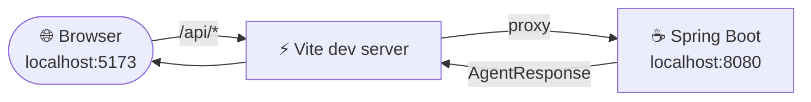
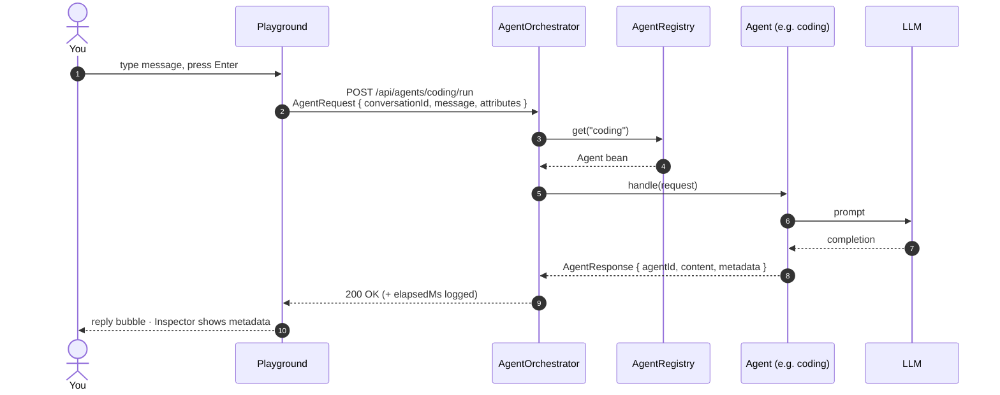
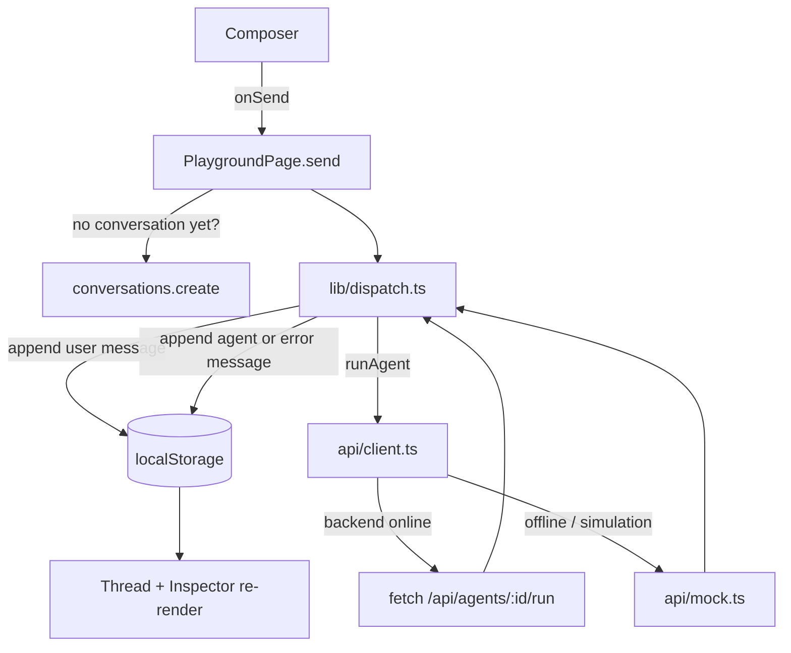
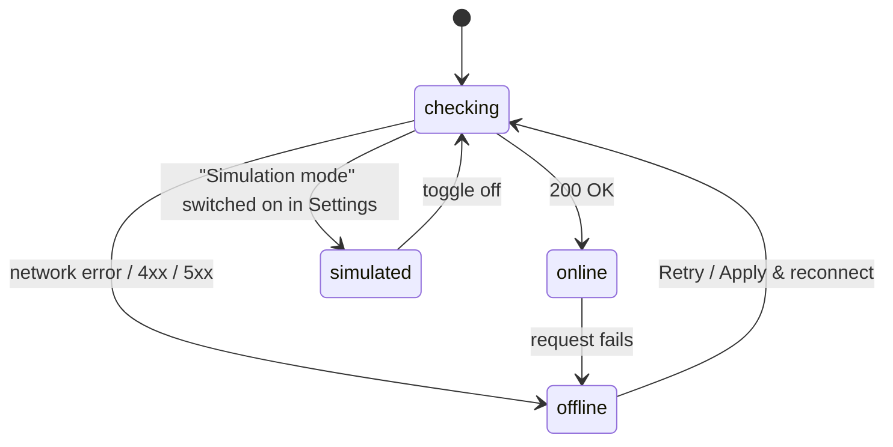
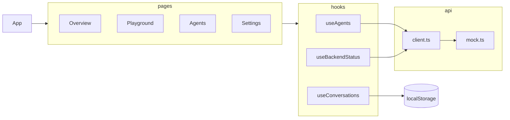

<div align="center">


# Multi-Agent AI Platform — Frontend

**One console to talk to many specialised AI agents.**
Pick an agent, send a message, inspect exactly what went over the wire.

[](https://react.dev)
[](https://www.typescriptlang.org)
[](https://vite.dev)
[](package.json)
[](../Backend)

</div>

---

## 📚 Contents

- [✨ What it does](#-what-it-does)
- [🚀 Quick start](#-quick-start)
- [🗺️ Pages](#️-pages)
- [🔄 How a request flows](#-how-a-request-flows)
- [🔌 Backend contract](#-backend-contract)
- [🧭 Offline & simulation mode](#-offline--simulation-mode)
- [🏗️ Project structure](#️-project-structure)
- [🎨 Design notes](#-design-notes)
- [🧰 Scripts](#-scripts)
- [❓ FAQ](#-faq)

---

## ✨ What it does

| | |
|---|---|
| 💬 **Playground** | Chat with any registered agent. Each agent's options (language, style, document…) appear as controls; PDFs/text upload right there. Conversations are saved in your browser. |
| 🔍 **Inspector** | Click a reply to see its latency, model, metadata and the exact `AgentRequest` that produced it. |
| 🤖 **Agent registry** | Every `Agent` bean the backend discovered, with a guide for adding a new one. |
| 📊 **Overview** | Getting-started checklist, key numbers and a picture of how requests flow. |
| 🌗 **Dark / light** | Follows your system, switchable any time. Collapsible sidebar (`Ctrl/⌘ + B`). |
| 🧪 **Works offline** | No backend? The UI switches to simulated agents so you can still explore. |

---

## 🚀 Quick start

> **Prerequisites:** Node 20+ and (optionally) the backend running on port 8080.

```bash
cd Frontend
npm install
npm run dev          # ➜ http://localhost:5173
```

The dev server proxies `/api` and `/actuator` to `http://localhost:8080`, so the browser sees a
single origin and no CORS setup is needed.



---

## 🗺️ Pages

Navigation is hash-based, so every page has a shareable URL and a refresh keeps you where you are.

| Route | Page | What you'll find |
|---|---|---|
| `#/` | **Overview** | Intro, ✅ getting-started checklist, stat tiles, request pipeline, recent conversations |
| `#/playground` | **Playground** | Conversation list · chat thread · composer · response inspector |
| `#/playground/<id>` | Playground | Opens one specific conversation |
| `#/agents` | **Agents** | Registry cards + *"Adding a new agent"* guide with Java snippet |
| `#/settings` | **Settings** | API base URL, simulation toggle, theme, clear local data |

<details>
<summary><b>Playground layout</b></summary>

```
┌──────────────┬────────────────────────────────────┬───────────────────┐
│ Conversations│  Talking to  [Coding Agent ▾]      │ Inspector         │
│              │  Generates, explains and refactors │                   │
│ ▸ Debounce…  │────────────────────────────────────│ RESPONSE          │
│   Research…  │                                    │  agent   Coding   │
│   Summary…   │   You: Write a debounce fn         │  latency 812 ms   │
│              │                                    │  model   gemini…  │
│              │   🤖 Here is a first implement…    │  metadata {…}     │
│              │      ```ts … ```                   │                   │
│              │                                    │ REQUEST           │
│              │────────────────────────────────────│  { message: … }   │
│  + New       │  [ Message the Coding Agent…  ➤ ]  │                   │
│              │  Enter to send · Attributes (JSON) │ CONVERSATION      │
└──────────────┴────────────────────────────────────┴───────────────────┘
```

</details>

---

## 🔄 How a request flows

You choose the agent (Phase 2 — *client-driven routing*). An LLM-based router can slot into the
orchestrator later without changing this UI.



Inside the browser, sending a message goes through one small function so the flow is easy to follow:



---

## 🔌 Backend contract

The client ([`src/api/client.ts`](src/api/client.ts)) expects the Phase 3 REST layer to expose:

| Method | Path | Body → Response |
|---|---|---|
| `GET` | `/api/platform` | → provider / model / whether a key is configured |
| `GET` | `/api/agents` | → `[{ id, name, description, capabilities, parameters }]` |
| `POST` | `/api/documents` | multipart `file` → `DocumentSummary` |
| `POST` | `/api/agents/{id}/run` | `AgentRequest` → `AgentResponse` |

```jsonc
// AgentRequest (mirrors the backend record)
{ "conversationId": "3f2a…", "message": "Write a debounce function", "attributes": { "language": "ts" } }

// AgentResponse
{ "agentId": "coding", "content": "Here is…", "metadata": { "model": "gemini-2.5-flash", "tokens": { … } } }
```

- Errors are read as **RFC 9457 `problem+json`** (`detail` / `title`) — the backend already has
  `spring.mvc.problemdetails.enabled=true`.
- `name` and `capabilities` are optional; the UI derives a name from the `id` if absent.
- Change the base path with `VITE_API_BASE` at build time, or override it at runtime in **Settings**.

> ⚠️ The backend includes `spring-boot-starter-security`. Until a security config permits
> `/api/**` (and disables CSRF for it), every call will return **401** and the UI will fall back to
> simulation mode.

---

## 🧭 Offline & simulation mode

The app probes `GET /api/agents` on load and picks a mode automatically:



| Mode | Badge in sidebar | Behaviour |
|---|---|---|
| 🟢 `online` | Backend online | Real agents, real replies |
| 🟠 `offline` | Backend offline · simulated | Banner shown; canned agents & replies so the UI stays usable |
| 🔵 `simulated` | Simulation mode | Same as offline, but chosen on purpose (great for demos) |

Simulated replies carry `"simulated": true` in their metadata and a **simulated** tag on the bubble,
so they're never mistaken for real output.

---

## 🏗️ Project structure

```
Frontend/
├─ index.html                 # fonts, meta, #root
├─ vite.config.ts             # React plugin + /api proxy
├─ public/
│  ├─ favicon.svg
│  └─ logo.svg
└─ src/
   ├─ main.tsx                # React root
   ├─ App.tsx                 # shell: sidebar + route switch + offline banner
   ├─ types.ts                # AgentInfo, AgentRequest, AgentResponse, ChatMessage, Conversation
   ├─ index.css               # 🎨 design tokens (dark/light), reset, base
   ├─ app.css                 # component styles
   ├─ api/
   │  ├─ client.ts            # fetch wrapper, backend-status store, mode selection
   │  └─ mock.ts              # simulated agents + replies
   ├─ hooks/
   │  ├─ useAgents.ts         # load / reload the registry
   │  ├─ usePlatform.ts       # provider / model / key state
   │  ├─ useDocuments.ts      # documents for the document agent
   │  ├─ useConversations.ts  # localStorage-backed conversations
   │  ├─ useBackendStatus.ts  # subscribe to online/offline/simulated
   │  ├─ useHashRoute.ts      # tiny hash router
   │  ├─ useSidebar.ts        # collapsed state + Ctrl/⌘+B
   │  └─ useTheme.ts          # dark/light
   ├─ lib/
   │  ├─ dispatch.ts          # send-message flow (user msg → runAgent → agent/error msg)
   │  ├─ attributes.ts        # option values → AgentRequest.attributes
   │  ├─ storage.ts           # safe localStorage helpers + keys
   │  ├─ agentColor.ts        # stable colour per agent id
   │  └─ util.ts              # uid, formatting
   ├─ components/
   │  ├─ Sidebar.tsx          # nav, status badge, theme, collapse toggle
   │  ├─ PageHeader.tsx       # eyebrow / title / description / actions
   │  ├─ EmptyState.tsx
   │  ├─ ConversationList.tsx
   │  ├─ MessageBubble.tsx
   │  ├─ Markdown.tsx         # minimal, safe markdown → React (no innerHTML)
   │  ├─ Composer.tsx         # textarea + per-agent option controls (+ advanced JSON)
   │  ├─ DocumentPicker.tsx   # choose / upload a document
   │  ├─ Inspector.tsx        # response / request / conversation panels
   │  ├─ AgentAvatar.tsx
   │  ├─ BackendStatusBadge.tsx
   │  └─ Icons.tsx
   └─ pages/
      ├─ OverviewPage.tsx
      ├─ PlaygroundPage.tsx
      ├─ AgentsPage.tsx
      └─ SettingsPage.tsx
```



---

## 🎨 Design notes

- **Zero UI dependencies.** Plain CSS with tokens in [`src/index.css`](src/index.css); switch
  themes by setting `data-theme="light|dark"` on `<html>`.
- **Typography:** Inter + JetBrains Mono from Google Fonts, with system fallbacks.
- **Responsive:** sidebar becomes a top bar under 900 px; inspector hides under 1180 px (toggle it
  back from the chat header).
- **Accessible by default:** focus rings, `aria-current`, live regions for typing indicator,
  `prefers-reduced-motion` respected.
- **Safe rendering:** agent output goes through a tiny markdown parser that emits React elements —
  never `dangerouslySetInnerHTML`.

---

## 🧰 Scripts

| Command | What it does |
|---|---|
| `npm run dev` | Start the dev server with HMR on `:5173` |
| `npm run build` | Type-check (`tsc -b`) and bundle to `dist/` |
| `npm run preview` | Serve the production bundle locally |
| `npm run lint` | ESLint (incl. React 19 compiler rules) |

---

## ❓ FAQ

<details>
<summary><b>Why do I see "Backend offline · simulated"?</b></summary>

The app couldn't reach `GET /api/agents`. Either the Spring Boot app isn't running on 8080, the REST
controllers don't exist yet, or Spring Security rejected the call. Start/fix the backend, then click
**Retry** in the banner or **Apply & reconnect** in Settings.
</details>

<details>
<summary><b>Where are my conversations stored?</b></summary>

In your browser's `localStorage` under `maap.conversations`. They never leave your machine. Clear
them from **Settings → Local data**.
</details>

<details>
<summary><b>How do I send extra data to an agent (e.g. a document id)?</b></summary>

In the composer click **Attributes (JSON)** and enter an object such as
`{"documentId": "doc_123"}`. It is sent as `AgentRequest.attributes` and shown in the Inspector.
</details>

<details>
<summary><b>How do I add a new agent?</b></summary>

On the backend, implement `Agent` as a Spring `@Component` — see the guide at the bottom of the
**Agents** page. The registry discovers it on restart and the UI picks it up on **Refresh**.
</details>

---

<div align="center">
<sub>Part of the <a href="../">Multi-Agent AI Platform</a> · Backend lives in <a href="../Backend"><code>../Backend</code></a></sub>
</div>
