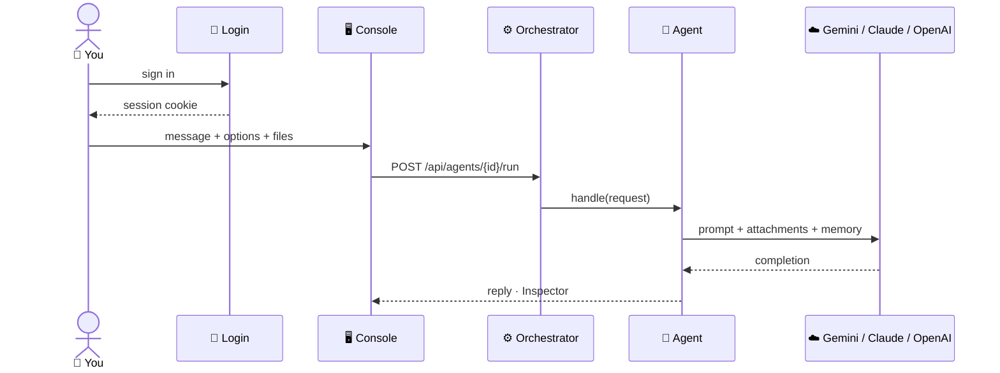

# 📈 Project Progress

**How the Multi-Agent AI Platform got from an empty folder to what it is today.**
For how to run and use the project, see [`README.md`](README.md).

---

## 1. 🟢 Present Work Progress

> Where the project stands right now — what works, what is on disk, and what is being finished.

### 🧭 Quick status

| | |
|---|---|
| ⚙️ **Backend** | 🟢 Stable — 5 agents, 3 model providers, real login, 72/72 tests passing |
| 🖥️ **Frontend** | 🟢 Stable — full chat console behind a login, zero runtime dependencies |
| 🔐 **Auth (Phase 9)** | 🟢 Shipped — committed across 23 commits, verified against real HTTP |
| 🗄️ **Persistence (Phase 10)** | 🟡 Built & verified, **not yet committed** — uploads and conversations survive a restart, with no database to install |
| 🚧 **In flight** | 🟡 Login-screen polish, uncommitted in the working tree ([details](#-in-flight)) |
| 📚 **Docs** | 🟢 `README.md` + this file, both kept in sync with the real code |
| 👥 **Persistent accounts** | 🔴 Not started — `AUTH_USERS` is still read into memory on boot |

### 🏗️ How a request flows today

### ✅ Current Progress

> Snapshot of the code on disk right now.

#### ⚙️ Backend

| Area | Status | Detail |
|---|---|---|
| 🤖 Agents | ✅ Done | 5 self-describing Spring beans: coding, research, summarizer, document, general |
| ☁️ Model providers | ✅ Done | Gemini (default), Claude, OpenAI — one env var switches all of it |
| 📎 File attachments | ✅ Done | Any agent, shared context budget, stale ids skipped gracefully |
| 🧠 Conversation memory | ✅ Done | Last 20 messages replayed per conversation, forgettable on request |
| ⚠️ Error handling | ✅ Done | RFC 9457 `problem+json` everywhere — including the `401`, which never reaches a controller |
| 🔐 Authentication | ✅ Done | Session login, BCrypt accounts from `AUTH_USERS`, every route gated except `/auth/login` |
| 🧪 Tests | ✅ 72 / 72 passing | All offline against a stubbed model and H2 — no API key, network or Docker |
| 🗄️ Persistent storage | 🟡 Built, uncommitted | Documents + conversation memory in an H2 file by default, Postgres on a profile; verified by restarting a live server |
| 👥 Persistent accounts | 🔴 Not started | `AUTH_USERS` still read into an in-memory user store on boot |
| 🧭 Auto agent routing | 🔴 Not started | Caller still names the agent; orchestrator is shaped for a router later |

#### 🖥️ Frontend

| Area | Status | Detail |
|---|---|---|
| 🔐 Login gate | ✅ Done | Whole console sits behind it; no page mounts, and no API call fires, before auth resolves |
| 🚪 Login landing page | ✅ Done | Hero, about, features, contact; sticky nav, mobile menu, own light theme independent of the console's |
| 💬 Playground | ✅ Done | Per-agent chat lists, edit-and-regenerate, response inspector |
| 🎨 Per-agent theming | ✅ Done | Deterministic accent color per agent, contrast-checked |
| 📎 Attachments UI | ✅ Done | Paperclip, drag-and-drop, paste-to-attach, all agents |
| 🧭 Offline / simulation | ✅ Done | Mirrors real behaviour once signed in; login itself always needs the backend |
| 📦 Dependencies | ✅ Zero runtime deps | Plain React — no UI kit, no state library |
| 🧹 Build health | ✅ Clean | `tsc -b`, `vite build`, ESLint (React 19 compiler rules) all pass |
| 🔑 Third-party sign-in | 🟡 Placeholder | Google button and sign-up link are visible but answer with a notice |
| 🌊 Streaming replies | 🔴 Not started | Replies arrive whole today, not token-by-token |

**Legend:** ✅ done & committed &nbsp;·&nbsp; 🟡 partial / placeholder &nbsp;·&nbsp; 🔴 not started

### 🚧 In flight

> On disk, **not yet committed** — the working tree ahead of `8518e71`. All of
> [Phase 10](#-phase-by-phase-history) is uncommitted too; what follows is the frontend work that
> was already in progress when it started.

| File | What's changing |
|---|---|
| `Frontend/src/pages/LoginPage.tsx` | A **Sign up** affordance beside Login (desktop nav and mobile menu), both routing to the honest "no self-service sign-up yet" notice. Username field relabelled from *Email or username* and no longer hints an email keyboard. A first-run hint naming the `admin` / `admin` default and how to change it. |
| `Frontend/src/login.css` | Styles for the above, plus a **scroll-jank fix**: the sticky nav and the blurred background blobs are promoted to their own compositor layers, so the browser composites an already-blurred layer per frame instead of redoing a 70px blur while you scroll. |
| `README.md` | Auth documented throughout — the login section of the quick start, the `platform.auth.users` row, the three `/api/auth/*` endpoints, the `401` rows in the error table, three new troubleshooting symptoms, and a rewritten security note replacing "`/api/**` is intentionally unauthenticated". |

Placeholders the login screen deliberately shows but doesn't implement yet — **Continue with
Google**, **Sign up**, **Forgot password** — each answer with a plain notice rather than a dead
link. They're listed on the [roadmap](#-roadmap) below.

---

## 2. 🔭 Future Work Progress

> What comes next, grouped by horizon.

### 🚀 Roadmap

#### Near-term
- [ ] 🧭 **Automatic agent routing** — let an LLM (or a cheap classifier) pick the agent from the
  message instead of the caller naming it.
- [ ] 🌐 **Live web search** for the Research Agent, which is knowledge-only today and says so.
- [ ] 🌊 **Streaming responses** — token-by-token to cut perceived latency on long answers.

#### Mid-term
- [x] 🗄️ **Persistent storage** — done in Phase 10, though the claim that motivated it was half
  wrong: conversation memory really was a one-dependency swap, `DocumentStore` really was a
  concrete class that had to be split first.
- [ ] 🐘 **Run the `postgres` profile at least once** — it shares its schema and JDBC code with the
  verified H2 path, but has never been started, because the machine has no Docker.
- [ ] 🔑 **Back the login screen's promises** — self-service sign-up, Google OAuth and password
  reset are all visible in the UI today and answered with a notice. Each one needs a real user
  store first.
- [ ] 📚 **Multi-file reasoning** for the Document Agent — cross-file comparison beyond today's
  two-or-three-file case.
- [ ] 💰 **Usage accounting** — token/cost totals per conversation, surfaced in the Inspector.

#### Long-term
- [ ] 👥 **Persistent accounts** — the one piece of state Phase 10 deliberately left alone.
  `AUTH_USERS` resets on restart; a real user store would let accounts, roles and passwords
  survive one, and is the prerequisite for sign-up and password reset above.
- [ ] 🔗 **Agent-to-agent handoff** — a pipeline mode (e.g. Research → Summarizer) is a natural
  extension of the existing orchestrator.
- [ ] 🐳 **Deployment story** — Dockerfile / Compose, plus `Secure` cookies + HTTPS for a real
  (non-localhost) deployment.

---

## 3. 📜 Past Work Progress

> How the project got here, phase by phase.

### 🗺️ Timeline flowchart

```mermaid
flowchart LR
    classDef done fill:#34d399,stroke:#0f9f6e,color:#04351f,font-weight:bold
    classDef pending fill:#fbbf24,stroke:#b7791f,color:#3a2a05,stroke-dasharray:5 5,font-weight:bold

    P0["📦 Phase 0<br/>Scaffolding"] --> P1["🧩 Phase 1<br/>Agent Core"]
    P1 --> P2["🖥️ Phase 2<br/>Frontend Foundation"]
    P2 --> P3["🔌 Phase 3<br/>Wiring Front ↔ Back"]
    P3 --> P4["🤖 Phase 4<br/>5 Agents + Docs"]
    P4 --> P5["💬 Phase 5<br/>Playground Overhaul"]
    P5 --> P6["📎 Phase 6<br/>File Attachments"]
    P6 --> P7["🛡️ Phase 7<br/>Security Hardening"]
    P7 --> P8["📖 Phase 8<br/>Documentation"]
    P8 --> P9["🔐 Phase 9<br/>Authentication"]
    P9 --> P10["🗄️ Phase 10<br/>Persistent Storage"]
    P10 --> WIP["🚧 In flight<br/>Login polish"]

    class P0,P1,P2,P3,P4,P5,P6,P7,P8,P9 done
    class P10,WIP pending
```

🟢 **green** = implemented, tested, and committed &nbsp;·&nbsp; 🟡 **yellow / dashed** = on disk, **not yet committed**

### 📅 Phase-by-phase history

📦 <b>Phase 0 — Scaffolding</b> (Sep 18) · two apps that boot, nothing wired yet

| Commit | What it added |
|---|---|
| `810600e` | Vite + React 19 + TypeScript frontend scaffold |
| `04b3960` | Spring Boot 4 backend scaffold |
| `5fc9723` | Trimmed backend dependencies so the app context actually boots |

**Outcome:** two apps that start, neither one doing anything yet.

🧩 <b>Phase 1 — Agent core</b> (Sep 18) · the foundational design decision

Agents are plain Spring beans that describe themselves — made early, never revisited.

| Commit | What it added |
|---|---|
| `f1e6bd1` | `Agent` interface, `AgentRegistry` (auto-discovers `@Component` beans), `AgentOrchestrator` (dispatch by id) |

**Outcome:** a backend that can run an agent by name, with zero agents implemented yet.

🖥️ <b>Phase 2 — Frontend foundation</b> (Sep 19) · first working UI

| Commit | What it added |
|---|---|
| `4d76b31` | First components |
| `c2e315d` | First hooks |
| `61be389` | First libraries (pure logic, separated from components) |
| `2fc0664` | The four pages: Overview, Playground, Agents, Settings |
| `1917714` | Sidebar + hash-based routing wired into `App.tsx` |
| `9b0f1ae` | End-to-end functionality — first version that actually worked |

**Outcome:** a console with real navigation and a chat page, talking to nothing real yet.

🔌 <b>Phase 3 — Wiring frontend to backend</b> (Sep 19–20) · CORS fix + provider churn

| Commit | What it added |
|---|---|
| `500cd8c` | Shared TypeScript types mirroring the backend's Java records |
| `f711de4` | Design tokens and base styles (dark/light theme system) |
| `8c33a18` | Real API client + an in-browser **simulation mode** for when the backend is offline |
| `ca5acbf` | Vite dev-server proxy so the browser only ever talks to one origin |
| `386a94a` | Page metadata, fonts |

Two bugs fixed here, both from real testing rather than code review:

- 🐛 **CORS rejecting the dev server.** Vite falls back to port 5174+ when 5173 is busy; the
  backend's CORS allowlist was pinned to `5173` exactly. Fixed with `http://localhost:*` patterns.
- 🔁 **Provider churn.** The backend went through three model providers before settling —
  **OpenAI → Anthropic Claude → Google Gemini** — while building `AI_PROVIDER` into a proper
  switch (all three stay on the classpath; one activates). Gemini is the default today for its
  free tier.

**Outcome:** a console that talks to a real backend, with an offline fallback so the UI is always
explorable.

🤖 <b>Phase 4 — Five agents, document pipeline, first docs</b> (Sep 20) · feature-complete v1

The backend grew from "can run an agent" to five real ones, plus everything needed to ground an
answer in an uploaded file: `DocumentStore`, PDF/text extraction, and the `document` agent. The
first `README.md` landed here too — commit `e707cb9`.

**Outcome:** feature-complete v1 — five working agents, document Q&A, a documented API.

💬 <b>Phase 5 — The Playground overhaul</b> (Sep 20) · the single biggest chunk of work

Turned a working chat page into a real chat product, confirmed with two design decisions along
the way (edit-and-regenerate over edit-in-place; accent-only per-agent color over full-theme).

| Area | What changed |
|---|---|
| 📐 **Layout** | Sidebar auto-collapses when you open the Playground, so the conversation takes the full screen |
| ✏️ **Editing** | Edit a sent prompt — the stale reply is dropped and the agent re-answers the new text |
| 🎨 **Per-agent identity** | Each agent gets a deterministic, contrast-checked accent color |
| 📤 **Output** | Wider reply bubbles for long output; code blocks get a language chip + copy button |
| 💻 **Coding agent** | Free-text language field replaced with a real 21-language dropdown |
| 🗂️ **Per-agent chats** *(`ec72603`, `2e8bab0`, `3dd68db`)* | Each agent keeps its own conversation list; switching agents always opens a fresh chat |

**Outcome:** the Playground stopped looking like a wired-up prototype and started looking like a
product.

📎 <b>Phase 6 — Universal file attachments</b> (Sep 20) · any agent, any file

The `document` agent originally owned the only file picker. This phase generalised it: any agent
can ground an answer in an attached file.

| Commit(s) | What it added |
|---|---|
| `d04cfb9`, `27db4ca` | `AttachmentResolver` + `LlmAgent` folding files into every agent's system prompt |
| `a60b30e`, `dea1f82`, `4aa2ab6`, `d83ecb3` | Every concrete agent updated to take the resolver |
| `e1989be` | `document` agent simplified: answers from whatever is attached, `400` if nothing is |
| `8511783` | The now-redundant `DOCUMENT` parameter type removed |
| `3cd57ad` | `Attachment[]` added to `ChatMessage` so a sent file shows as a chip |
| `e351eae` | Paperclip button beside Send, plus drag-and-drop and paste-to-attach |
| `d5e826c`, `c4b99aa` | Frontend client and simulation mode brought in line |
| `2f07e9d`, `24ae5fa` | 4 new backend tests: shared context budget, evicted ids skipped gracefully |

**Outcome:** attaching a file is a universal action, not a document-agent feature.

🛡️ <b>Phase 7 — Security hardening</b> (Sep 20–21) · a real secret, caught and scrubbed

A real Gemini API key was accidentally hardcoded into `application.properties` — twice, the second
time after the first was already caught. Both times:

1. 🔧 Replaced the hardcoded value with the same `${GEMINI_API_KEY:missing-api-key}` placeholder
   pattern the other providers already used.
2. 🧹 Scrubbed the literal key from local git history (`git filter-branch` across 43 commits).
3. 🔑 **Rotated the exposed key** — scrubbing local history doesn't undo a key that already
   reached GitHub; only revoking it does.

✅ GitHub's push protection caught the second occurrence before it left the machine.

**Outcome:** the history that is actually published — `main`, and everything pushed to `origin` —
carries no literal key. The pre-rewrite commits still exist on a local-only `backup-before-scrub`
branch that was never pushed; it is a local artefact of the scrub, not part of the project's
published history.

> 🧠 **The standing lesson from this phase:** `application.properties` is a *tracked* file. A key
> typed into it for a quick local run is one `git add -A` away from the same incident. Export
> `GEMINI_API_KEY` in the shell instead — the placeholder default is there precisely so the file
> never has to change.

📖 <b>Phase 8 — Documentation</b> (Sep 21) · README rebuilt into a real reference

The root `README.md` was rebuilt twice — first a quick-start-plus-feature-tour, then the
comprehensive reference it is today: full API shapes, every config property, an "add your own
agent" walkthrough, and a troubleshooting table built from real errors. This file is the third
piece: the project's own history, kept separate from the usage guide.

🔐 <b>Phase 9 — Real authentication</b> (Sep 22) · 🟢 shipped in 23 commits

Until this phase, `/api/**` was open by design. Asked for a real login gate, the fix touched the
platform's actual security posture — and grew a proper front door along the way.

**Backend — the gate itself**

| Commit | What it added |
|---|---|
| `472b8b1` | `platform.auth.users` on `PlatformProperties` — accounts as config, not code |
| `a65eb85` | `SecurityConfig` rebuilt: `username:password` pairs BCrypt-hashed on boot, every `/api/**` route except login now requires a session, `HttpSessionSecurityContextRepository` holding it |
| `f4e4515` | A custom `AuthenticationEntryPoint` so a "no session" `401` keeps the same RFC 9457 `problem+json` shape as every other error |
| `f8ec8ee` | `AuthController` — `POST /api/auth/login`, `GET /api/auth/me`, `POST /api/auth/logout` |
| `526b132`, `8518e71` | `AuthResponse` / `LoginRequest` DTOs |

Two decisions worth recording. **CSRF stays off for `/api/**`** — it's a token-less JSON API
consumed by the SPA and by scripts, not by browser form posts, and the cookie is first-party
through the dev proxy. And the entry point **writes its JSON by hand** rather than through a
mapper bean: Spring Boot 4 puts both Jackson 2 and Jackson 3 on the classpath, and every value in
that response is a fixed literal or a same-origin request path.

**Tests — every existing controller test had to learn about auth**

| Commit | What it added |
|---|---|
| `083c1f0` | One shared `MockMvcBuilderCustomizer`: authenticate-by-default, so existing tests kept asserting behaviour instead of logging in |
| `963722a` | `AuthControllerTest` — drives the real session cookie end to end |
| `9357875`, `da6e2c5` | Explicit unauthenticated-request cases, and a note on why the default exists |
| `22e4378`, `eeb4934`, `ebb15f1` | Unit-test fixtures updated for the new property |

**Frontend — the login experience**

| Commit | What it added |
|---|---|
| `9856dd1`, `448c05b` | `LoginPage` + `login.css` — not just a form but a full landing page: hero, about, features and contact sections, sticky nav, mobile burger menu |
| `78edfc7` | `App` split into a thin gate + the existing shell, which doesn't mount — and doesn't call the API — until authenticated |
| `eddd137` | `useAuth` — checks for a session once on mount so a refresh doesn't sign you out |
| `0f902a9` | Session expiry caught centrally: a `401` from *any* call in flight sends you back to login |
| `984038a`, `ca3672e` | Account row + sign-out button in the Sidebar |
| `230cc2d`, `e773dd6` | `IconLogout`, `IconMail`, `IconLock`, `IconEye`, `IconEyeOff`, `IconMenu`, `IconGoogle`; `rememberUser` storage key |
| `8ac9c91` | (alongside) OverviewPage steps became expandable |

🚫 **No simulation-mode bypass for login** — simulation is a setting reached *inside* the console,
so it can't exist upstream of the gate. A session that dies mid-visit returns you to the login
screen rather than silently switching to simulated replies.

✅ Verified against real HTTP end to end (not just `MockMvc`): backend + Vite dev server running
together, confirmed the `401`, the `Set-Cookie` forwarding through the proxy, and the resulting
cookie authenticating the next call.

**Outcome:** the console requires a real, session-backed sign-in, and has a front door that looks
like one.

🗄️ <b>Phase 10 — Persistent storage</b> (Sep 22) · 🟡 built &amp; tested, not yet committed

> On disk and passing 72/72, but with no commit table yet — like Phase 9 before it was committed.

Until this phase a restart wiped every uploaded document and every conversation. Two halves, and
they turned out to be very different amounts of work.

**Conversation memory was a dependency, not a rewrite.** `AiConfig` already took a
`ChatMemoryRepository` as a bean and wrapped whatever it got in a sliding window. Adding
`spring-ai-starter-model-chat-memory-repository-jdbc` swapped Spring AI's in-memory repository for
its JDBC one with **zero changes** to `AiConfig`, the agents, or `ConversationController`. The
comment in that file predicting exactly this turned out to be accurate.

**Documents were not.** The roadmap claimed `DocumentStore` "sits behind an interface specifically
so a real database is a swap" — it did not; it was a concrete `@Component` wrapping a
`ConcurrentHashMap`. So the interface had to be extracted first:

| Piece | What it does |
|---|---|
| `DocumentStore` | Now the interface: `save` / `find` / `delete` / `all` / `size`, plus a `get` default that throws `DocumentNotFoundException` |
| `JdbcDocumentStore` | The default. `JdbcClient` over `platform_documents`, eviction as a single `DELETE ... NOT IN (SELECT ... LIMIT ?)` so concurrent uploads can't both pick the same victim |
| `InMemoryDocumentStore` | The original map, kept as a real selectable option rather than deleted |
| `StorageConfig` | One `platform.storage` switch picking both halves together |
| `schema.sql` | `platform_documents`, written portably so the same DDL runs on H2 and Postgres |

**The database choice was made twice.** Postgres was the obvious target — `compose.yaml` and the
`postgresql` driver had been scaffolded back in Phase 0 and never touched — so it went in as the
default, started on boot by Spring Boot's Docker Compose support.

🐛 **That broke the backend.** Docker isn't installed on the development machine, so
`spring.docker.compose.enabled=true` turned into `Cannot run program "docker"` at startup and the
app never bound port 8080. The visible symptom was in the browser: signing in returned **404 Not
Found**, which was just Vite's proxy with nothing behind it. The lesson was about verification, not
about Postgres — the whole phase had been tested through `./mvnw test`, and a passing suite says
nothing about whether the application actually boots.

So the default flipped to an **H2 file** under `Backend/data`, which persists with nothing
installed, and Postgres moved to a `postgres` profile. Same `schema.sql`, same JDBC code, same two
tables; only the dialect differs. `SPRING_DATASOURCE_URL` still points at any Postgres without a
profile at all.

🧪 **The contract test earned its keep immediately.** `DocumentStoreTest` became one set of
assertions run against *both* implementations, and it failed the first time on two real
inconsistencies that testing either store alone would have missed:

- `delete(null)` threw `NullPointerException` from the in-memory store (`ConcurrentHashMap` rejects
  null keys) where the database one returned `false`.
- `uploadedAt` could not round-trip: `Instant.now()` is nanosecond-resolution on Java 25, while
  `TIMESTAMP` keeps microseconds — so `save()` returned a timestamp no later `find()` could
  reproduce. Now truncated once, in the interface, so both stores agree.

A third fix came from review rather than a failure: the column is `TIMESTAMP WITH TIME ZONE` and
is read as an `OffsetDateTime`, so a change to the server's timezone can't shift stored times.

🚫 **The platform still runs with nothing installed.** A `memory` profile restores the old
behaviour completely — and because the Postgres driver is on the classpath and Spring AI's JDBC
auto-configuration registers a schema initializer that wants a datasource, "no database" means
excluding both, not merely leaving them unused. A wiring test asserts that profile's context
contains no `DataSource` at all, so the claim can't quietly rot.

✅ **Verified against a running server, not just the test suite.** Backend booted for real; signed
in with `admin`/`admin` (`200` plus a `Set-Cookie`, `/api/auth/me` returning the user, an
unauthenticated call still `401`); uploaded a document; killed the process; restarted it; the
document came back with the same id, the same text and the same microsecond-precise timestamp.

⚠️ **The Postgres profile is still unrun**, for the same reason it stopped being the default:
no Docker on this machine. It shares its schema and all its JDBC code with the H2 path that is
verified, but the profile itself has never been started.

**Outcome:** uploads and conversations survive a restart, on a machine with nothing installed.
Accounts still don't.

---

🕓 Timeline: 18–22 September 2026 · 📦 70 commits on <code>main</code> · 🧪 72 tests passing 
See <a href="README.md">README.md</a> for how to run and use the project today.

