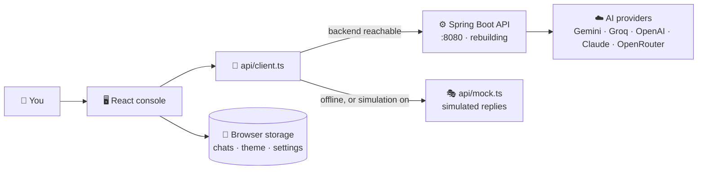

<div align="center">


# Multi-Agent AI Platform

**Five specialised AI agents, one console to talk to them.**

[](Frontend/package.json)
[](Frontend/package.json)
[](Frontend/package.json)
[](#-quick-start)
[](BACKEND.md)

</div>

> [!NOTE]
> **Project status (Sep 24, 2026):** the frontend console is complete and runs on its own with
> **simulated** replies. The Spring Boot backend was removed from this repo and is being rebuilt —
> follow [`BACKEND.md`](BACKEND.md). History and roadmap: [`PROGRESS.md`](PROGRESS.md).

---

## ✨ What this is

A chat console for a team of focused AI agents — coding, research, summarising, document Q&A and
general chat. The big idea: **each agent describes itself** (name, options, capabilities), and the
console builds its cards, menus and controls from that description. Add an agent on the backend and
it appears in the console with no frontend changes.

| | Feature |
|---|---|
| 💬 | **Per-agent chats** — each agent keeps its own conversation list |
| 📎 | **File attachments** — paperclip, drag & drop or paste; files stay in context for the whole chat |
| ✏️ | **Edit & resend** — change a sent prompt and get a fresh answer |
| 🔍 | **Response Inspector** — latency, provider, model, metadata and the exact request |
| 🎨 | **Per-agent colours** — you always know who you're talking to |
| 🎭 | **Works without a backend** — simulated replies, clearly marked |
| 🌗 | **Dark & light theme** |
| 📱 | **Responsive** — from 320px phones to wide screens |

---

## 🚀 Quick start

**You need:** Node 20+.

```bash
cd Frontend
npm install
npm run dev
```

Open <http://localhost:5173> and sign in with **any username and password** — the login page is a
placeholder until the backend returns. The console opens with a **Backend offline** banner and
simulated replies. That is expected today.

> 💡 To use simulated replies on purpose and hide the banner, turn on **Settings → Simulation mode**,
> then press **Apply & reconnect**.

When the backend is rebuilt, it runs on port `8080` and the dev server forwards `/api` to it —
nothing to configure.

---

## 🧭 How it works



- 💾 **Chats live in your browser** (`localStorage`) — per device, until you delete them.
- 🟢 **Status badge** in the sidebar: *Backend online*, *Backend offline · simulated* or
  *Simulation mode*.

---

## 🤖 The agents

Simulated today; real once the backend is rebuilt.

| Agent | What it does | Options |
|---|---|---|
| 💻 **Coding Agent** | Working code first, then a short explanation | `language` — Auto-detect or one of 21 |
| 🔬 **Research Agent** | Summary, key findings, open questions, confidence | — |
| 📝 **Summarizer Agent** | Bullets, a TL;DR or an executive brief | `style`, `maxWords` |
| 📄 **Document Agent** | Answers only from the files you attach | — |
| 💬 **General Assistant** | Everything else | — |

---

## 🗂️ Pages

| Route | Page | What's there |
|---|---|---|
| `#/` | 🏠 Overview | Getting-started checklist, stats, how a request flows, recent chats |
| `#/playground` | 💬 Playground | Chat list · thread · composer · Inspector |
| `#/agents` | 🤖 Agents | A card for every agent, plus how to add one |
| `#/settings` | ⚙️ Settings | API address, simulation mode, theme, AI providers, delete local chats |

---

## 📁 Project layout

```text
Multi-Agent-AI-Platform/
├── Frontend/                 🖥️ the React console
│   ├── public/               logo, favicon
│   └── src/
│       ├── api/              client.ts (real backend) · mock.ts (simulation)
│       ├── pages/            Login · Overview · Playground · Agents · Settings
│       ├── components/       Composer · MessageBubble · Inspector · ErrorBoundary · …
│       ├── hooks/            chats, attachments, agents, theme, routing, …
│       ├── lib/              send/edit flow, storage, colours, helpers
│       └── types.ts          the JSON shapes shared with the backend
├── BACKEND.md                ⚙️ rebuild the backend, step by step
├── PROGRESS.md               📈 history and roadmap
└── FRONTEND_BUG_AUDIT.md     🩺 frontend audit report
```

`Backend/` comes back in Phase 1 of [`BACKEND.md`](BACKEND.md).

---

## 🔌 What the console expects from the backend

| Method | Path | Used for |
|---|---|---|
| `GET` | `/api/agents` | The agent list — also the "Backend online" check |
| `POST` | `/api/agents/{id}/run` | Send a message |
| `GET` | `/api/platform` | AI provider, model and document limits (Settings) |
| `POST` · `DELETE` | `/api/documents` · `/api/documents/{id}` | Attach or remove a file |
| `DELETE` | `/api/conversations/{id}` | Forget a chat on the server |

Errors come back as `application/problem+json`; the console shows their `detail` text. JSON field
names match [`Frontend/src/types.ts`](Frontend/src/types.ts). Full plan: [`BACKEND.md`](BACKEND.md).

---

## 🧪 Checks

```bash
cd Frontend
npm run lint     # ESLint with the React 19 rules
npm run build    # type-check + production bundle
```

Both pass. There are no automated tests yet — they're on the [roadmap](PROGRESS.md#-roadmap).

---

## 🆘 Troubleshooting

| What you see | Why · what to do |
|---|---|
| 🟠 *Backend offline* banner | Normal today — there is no backend yet. Replies are simulated. |
| 🏷️ Replies tagged **simulated** | Same reason. They never call an AI model. |
| 🔁 Refreshing the page shows the login again | The placeholder login isn't remembered. Expected until real sign-in returns. |
| 🔒 Google sign-in, Sign up, Forgot password show a notice | Not built yet. |
| ⚠️ Settings: *Use a path such as /api or a full http(s):// URL* | The API address needs `http://` or `https://`, or leave it empty. |
| 🔌 Backend running, but the console says offline | If you set a full URL in Settings (or `VITE_API_BASE`), the backend must allow CORS. Leave it empty to use the proxy. |
| 🗑️ Chats disappeared | They live in this browser only. Clearing site data, or Settings → Delete all, removes them. |

---

## 🔒 Security notes

- 🔑 **A Gemini key is in the pushed git history.** Revoke it — [`BACKEND.md`](BACKEND.md) Phase 0.
- 🚪 **The login page protects nothing yet.** Don't host the console publicly until real sign-in
  returns.
- 🙈 **Never put keys in the frontend.** Anything in a `VITE_*` variable is visible to every
  visitor.
- 💾 **Chats are stored unencrypted** in the browser's `localStorage`.

---

## 📚 More docs

| Doc | What's in it |
|---|---|
| 📈 [`PROGRESS.md`](PROGRESS.md) | Where the project stands, what's next, and how it got here |
| ⚙️ [`BACKEND.md`](BACKEND.md) | Rebuild the Spring Boot backend from an empty folder |
| 🩺 [`FRONTEND_BUG_AUDIT.md`](FRONTEND_BUG_AUDIT.md) | Every frontend issue found, and how it was fixed |

---

<div align="center">
<sub>Built with React 19 · TypeScript 6 · Vite 8 &nbsp;·&nbsp; Backend: Spring Boot 4.1 · Spring AI 2.0 (rebuilding)</sub>
</div>
