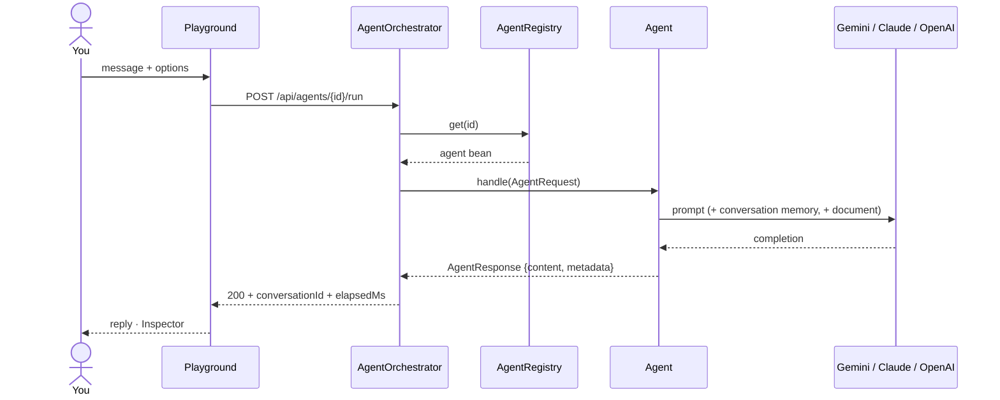

<div align="center">


# Multi-Agent AI Platform

**One orchestrator, many specialised AI agents.** A Spring Boot backend routes each request to the
right agent (coding, research, summarising, document Q&A, general chat) and a React console lets you
talk to them, tune their options, and inspect exactly what went over the wire.

</div>

```
Frontend/   React 19 + TypeScript + Vite console        →  Frontend/README.md
Backend/    Spring Boot 4 + Spring AI 2 service          →  Backend/README.md
```

## Run it

Two terminals.

**1. Backend** (Java 25, Maven wrapper included)

```powershell
cd Backend
$env:GEMINI_API_KEY = "AIza..."        # from https://aistudio.google.com/apikey
.\mvnw spring-boot:run                 # http://localhost:8080
```

Prefer Claude or OpenAI? Set `AI_PROVIDER=anthropic` + `ANTHROPIC_API_KEY`, or `AI_PROVIDER=openai` +
`OPENAI_API_KEY`. Keys live only in environment variables — never in the repo.

**2. Frontend** (Node 20+)

```powershell
cd Frontend
npm install
npm run dev                            # http://localhost:5173
```

The dev server proxies `/api` to the backend. If the backend is down, the UI switches to a
simulation mode so you can still explore it; if it is up but no key is set, the UI tells you which
variable to export.

## What you get

| Agent | Does | Options (rendered as controls in the playground) |
|---|---|---|
| `coding` | Code first, short rationale after | `language` |
| `research` | Summary / findings / open questions / confidence | — |
| `summarizer` | Bullets, TL;DR or executive brief | `style`, `maxWords` |
| `document` | Grounded Q&A over an uploaded PDF/text, with page quotes | `documentId` (upload right in the playground) |
| `general` | Fallback assistant | — |

- Conversations with server-side memory (`conversationId`), inspector showing latency, model, token
  usage and the exact request.
- Agents describe their own options (`Agent.parameters()`), so adding a new agent on the backend
  automatically gives it a card, an endpoint and proper controls in the UI.
- RFC 9457 problem details for every error, with provider failures translated into actionable
  messages (bad key → 502 "set X", rate limit → 503).

## Verify

```bash
cd Backend  && ./mvnw test        # 50 tests, no network needed
cd Frontend && npm run lint && npm run build
```

## How a request flows


