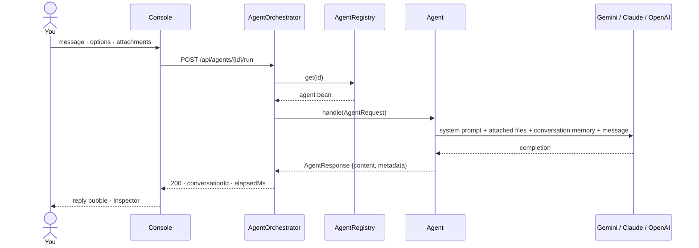

<div align="center">


# Multi-Agent AI Platform

**One backend, five specialised AI agents, one console to talk to them.**

A Spring Boot service hosts a set of focused agents (coding, research, summarising, document Q&A,
general chat), each one a plain Spring bean that describes its own capabilities. A React console
turns that self-description into agent cards, chat threads and form controls automatically — chat
with each agent, attach files, tune options, and inspect exactly what was sent to the model and
what came back.

[](Backend/pom.xml)
[](Backend/pom.xml)
[](Backend/pom.xml)
[](Frontend/package.json)
[](Frontend/package.json)
[](Frontend/package.json)

</div>

---

## Contents

- [What this is](#what-this-is)
- [Quick start](#quick-start)
- [The agents](#the-agents)
- [Architecture](#architecture)
- [How a request flows](#how-a-request-flows)
- [Backend reference](#backend-reference) — config, API, error mapping
- [Frontend reference](#frontend-reference) — pages, structure, modes
- [Add your own agent](#add-your-own-agent)
- [Testing](#testing)
- [Project layout](#project-layout)
- [Troubleshooting](#troubleshooting)
- [Security notes](#security-notes)
- [Project history & roadmap](#project-history--roadmap)

---

## What this is

Most "multi-agent" demos hardcode a router and a fixed UI per agent. This project inverts that:
**agents are self-describing Spring beans**, and the frontend renders itself from what the backend
reports. Add a new agent class on the backend, restart, and it gets a card on the Agents page, a
`POST /api/agents/{id}/run` endpoint, and the right form controls in the chat header — with no
frontend code changes.

Beyond that core idea, the console behaves like a real chat product, not a demo:

| Capability | Detail |
|---|---|
| **Per-agent conversations** | Each of the five agents keeps its own conversation list. Switching agents always opens a fresh chat; earlier threads stay filed under the agent they belong to. |
| **Universal file attachments** | Attach a PDF or text file to *any* agent — click the paperclip next to Send, drop files on the chat, or paste them. Files stay in context for the rest of that conversation, not just the message they were attached to. |
| **Edit & regenerate** | Edit a prompt you already sent; the stale reply is discarded and the agent answers the new text, ChatGPT-style. |
| **Response Inspector** | Click any reply to see its latency, model, token usage, the exact request body sent, and the response metadata. |
| **Per-agent theming** | Each agent gets a deterministic accent colour (your bubbles, the composer glow, the send button) so you always know who you're talking to. |
| **Provider-agnostic** | Google Gemini by default; switch to Anthropic Claude or OpenAI with one environment variable — no code changes. |
| **Works without a backend** | If the API is unreachable, the console switches to an in-browser simulation so the whole UI stays explorable. |
| **RFC 9457 errors everywhere** | Every failure — validation, unknown agent, provider auth, rate limit — comes back as `application/problem+json` with an actionable `detail`. |

---

## Quick start

**Prerequisites:** Java 25, Node 20+, and an API key for one model provider (free tier is fine).

Two terminals.

### 1. Backend — `http://localhost:8080`

```bash
cd Backend

# macOS / Linux
export GEMINI_API_KEY="AIza..."

# Windows PowerShell
$env:GEMINI_API_KEY = "AIza..."

./mvnw spring-boot:run
```

Get a free Gemini key at <https://aistudio.google.com/apikey>. The app boots fine without a key —
`/api/agents` and file uploads work — but every agent run answers `502` until one is set.

Prefer a different provider? Set `AI_PROVIDER` and the matching key — nothing else changes:

| Provider | `AI_PROVIDER` | Key variable | Get a key | Default model |
|---|---|---|---|---|
| Google Gemini | `google-genai` *(default)* | `GEMINI_API_KEY` | [aistudio.google.com/apikey](https://aistudio.google.com/apikey) | `gemini-3.5-flash-lite` |
| Anthropic Claude | `anthropic` | `ANTHROPIC_API_KEY` | [console.anthropic.com](https://console.anthropic.com/settings/keys) | `claude-opus-5` |
| OpenAI | `openai` | `OPENAI_API_KEY` | [platform.openai.com](https://platform.openai.com/api-keys) | `gpt-4o-mini` |

```powershell
$env:AI_PROVIDER = "anthropic"; $env:ANTHROPIC_API_KEY = "sk-ant-..."; .\mvnw spring-boot:run
```

All three provider starters sit on the classpath at once; `AI_PROVIDER` activates exactly one chat
model bean, so nothing else in the app changes when you switch.

> **Keys live in environment variables only — never in `application.properties`.** That file is
> committed to git; GitHub's push protection will reject a push that contains a real key, and
> anyone who clones the repo would get it. See [Security notes](#security-notes).

### 2. Frontend — `http://localhost:5173`

```bash
cd Frontend
npm install
npm run dev
```

The dev server proxies `/api` to the backend, so there's no CORS setup to do locally. Open the
printed URL, pick an agent from the header, and send a message. If the backend is up but no key is
set, a banner names the exact variable to export.

### Verify everything works

```bash
cd Backend  && ./mvnw test                     # 54 tests, stubbed model, no network or key needed
cd Frontend && npm run lint && npm run build    # type-check + bundle
```

---

## The agents

| Id | Name | What it does | Options |
|---|---|---|---|
| `coding` | Coding Agent | Working code first in a fenced block, then a short rationale. A picked language always wins, even if the question mentions another one. | `language` — Auto-detect or one of 21 languages |
| `research` | Research Agent | Breaks a topic into a summary, key findings, open questions and a confidence rating. Knowledge-based; no live web search yet. | — |
| `summarizer` | Summarizer Agent | Condenses long text into bullets, a TL;DR, or an executive brief. | `style` (`bullets` / `tldr` / `executive`), `maxWords` |
| `document` | Document Agent | Answers strictly from the files attached to the conversation, quoting the relevant passage (with page markers for PDFs) before answering. Refuses with a clear `400` if nothing is attached. | — |
| `general` | General Assistant | Fallback for anything the specialists don't cover. | — |

Options render as controls in the **chat header**, next to the New chat button. File attachments
are deliberately *not* modeled as an option — every agent accepts them through the same paperclip
button, because grounding an answer in a file is a universal need, not a document-agent-only one.

---

## Architecture

```
┌─────────────────────────────┐        ┌──────────────────────────────────────────────┐
│           Frontend           │        │                    Backend                     │
│   React 19 · TypeScript      │  HTTP  │            Spring Boot 4 · Spring AI 2         │
│                               │◄──────►│                                                │
│  pages/    Overview,          │  JSON  │  web/        Controllers, DTOs, error handler  │
│            Playground,        │        │  agent/core  Agent contract, registry,         │
│            Agents, Settings   │        │              orchestrator                      │
│  components/ Composer,        │        │  agent/llm   LlmAgent base class                │
│              MessageBubble,   │        │  agent/impl  5 concrete agents                  │
│              Inspector, ...   │        │  document    Store, text extraction,            │
│  hooks/    useConversations,  │        │              attachment resolution              │
│            useAttachments,    │        │  config      Provider selection, CORS, security │
│            useAgents, ...     │        │                                                 │
│  api/      client.ts (real)   │        │                          │                      │
│            mock.ts (offline)  │        │                          ▼                      │
└───────────────┬───────────────┘        │           Gemini · Claude · OpenAI              │
                 │                       └──────────────────────────────────────────────┘
        localStorage (per-browser)
        conversations, theme, sidebar state
```

**Backend, three layers:**

1. **`agent/core`** — the `Agent` contract every agent implements; `AgentRegistry`, which
   discovers every `@Component` implementing `Agent` at startup (no manual registration); and
   `AgentOrchestrator`, the single entry point that looks an agent up by id and calls it.
2. **`agent/llm`** — `LlmAgent`, the abstract base class model-backed agents extend. It owns a
   `ChatClient` pre-loaded with the agent's system prompt, attaches Spring AI's `ChatMemory` per
   call when a `conversationId` is present, and folds any attached files into that call's system
   prompt (never into memory, so files don't bloat the replayed context).
3. **`document`** — `DocumentStore` (capacity-bounded, in-memory, oldest evicted first),
   `DocumentTextExtractor` (PDFBox for PDFs, UTF-8 for text formats), and `AttachmentResolver`,
   which turns a request's `attachments` id list into the system-prompt block every `LlmAgent`
   call injects.

**Frontend, mirrors the same shape:** `api/` talks to the backend (or simulates it), `hooks/` hold
state (conversations in `localStorage`, agents, attachments, theme, route), `lib/` has the pure
logic (send/edit dispatch, attribute building, per-agent color), and `components/`/`pages/` are
render-only.

---

## How a request flows



Conversations exist in two places, kept loosely in sync:

- **Browser** (`localStorage`) — the full transcript, forever, per device. This is what the UI
  renders.
- **Server** (`ChatMemory`, keyed by `conversationId`) — only the last `platform.memory.max-messages`
  turns (default 20), replayed to the model on each call so it has context. Deleting a
  conversation in the console also calls `DELETE /api/conversations/{id}` to forget it server-side.

A failed provider call never leaves a dangling, unanswered user turn in server memory — `LlmAgent`
rolls it back before the exception propagates.

---

## Backend reference

### Configuration

Everything lives in [`Backend/src/main/resources/application.properties`](Backend/src/main/resources/application.properties),
under two prefixes.

**Provider selection** (`spring.ai.*`, `AI_PROVIDER` env var):

| Property | Default | Purpose |
|---|---|---|
| `spring.ai.model.chat` | `${AI_PROVIDER:google-genai}` | Which provider's chat model bean is created |
| `spring.ai.google.genai.api-key` | `${GEMINI_API_KEY}` | Gemini key |
| `spring.ai.google.genai.chat.options.model` | `${GEMINI_MODEL:gemini-3.5-flash-lite}` | Gemini model |
| `spring.ai.anthropic.api-key` | `${ANTHROPIC_API_KEY}` | Claude key |
| `spring.ai.anthropic.chat.options.model` | `${ANTHROPIC_MODEL:claude-opus-5}` | Claude model |
| `spring.ai.openai.api-key` | `${OPENAI_API_KEY}` | OpenAI key |
| `spring.ai.openai.chat.options.model` | `${OPENAI_MODEL:gpt-4o-mini}` | OpenAI model |

Non-chat model types (embedding, image, audio, moderation) are switched off so no starter demands
an unrelated key.

**Platform behaviour** (`platform.*`, bound by [`PlatformProperties`](Backend/src/main/java/com/project/multi_agent_ai_platform/config/PlatformProperties.java)):

| Property | Default | Purpose |
|---|---|---|
| `platform.cors.allowed-origin-patterns` | `http://localhost:*,http://127.0.0.1:*` | Origins allowed to call the API directly (the Vite proxy needs none of this) |
| `platform.memory.max-messages` | `20` | Recent messages of a conversation replayed to the model |
| `platform.documents.max-context-chars` | `60000` | Attached-file text is truncated to this before reaching the model, split evenly across multiple files |
| `platform.documents.max-stored` | `50` | Oldest uploads are evicted once this many are held in memory |

### API

All `/api/**` endpoints are open (no auth) — this is a developer/single-user platform behind the
Vite proxy. Remaining Actuator endpoints stay behind HTTP Basic. Every error is
`application/problem+json`.

**Platform & agents**

| Method | Path | Notes |
|---|---|---|
| `GET` | `/api/platform` | `{provider, providerName, model, apiKeyConfigured, keyEnvVar, agents, memoryMaxMessages, documents}` — never the key itself |
| `GET` | `/api/agents` | `[{id, name, description, capabilities, parameters}]` for every registered agent |
| `GET` | `/api/agents/{id}` | One agent; `404` if unknown |
| `POST` | `/api/agents/{id}/run` | Run it — see body below |

```jsonc
// request
{
  "conversationId": "c-1",              // optional — server mints one if absent
  "message": "Write a debounce fn",     // required, ≤ 32 000 chars
  "attributes": {
    "language": "TypeScript",           // agent-specific options
    "attachments": ["doc_abc", "doc_def"]  // ids of files to ground the answer in
  }
}

// response
{
  "agentId": "coding",
  "content": "```typescript\n...\n```\n\nThe timer resets on every call...",
  "conversationId": "c-1",
  "elapsedMs": 812,
  "metadata": {
    "model": "gemini-3.5-flash-lite",
    "tokens": { "prompt": 142, "completion": 96, "total": 238 },
    "finishReason": "STOP",
    "language": "typescript"
  }
}
```

**Documents & attachments**

| Method | Path | Notes |
|---|---|---|
| `POST` | `/api/documents` | Multipart `file` — PDF or plain text (txt, md, csv, json, yaml, code files, …) → `201` + summary |
| `POST` | `/api/documents/text` | `{ "name": "...", "content": "..." }` → `201` + summary |
| `GET` | `/api/documents` | Summaries, newest first |
| `GET` | `/api/documents/{id}` | One summary: `{id, name, mediaType, chars, pages, uploadedAt, preview}` |
| `GET` | `/api/documents/{id}/content` | Extracted text (`text/plain`); PDF pages are marked `[page N]` |
| `DELETE` | `/api/documents/{id}` | `204` |

Upload a file first, then pass its id in `attributes.attachments` (accepts a single id or a list)
on any agent's `/run` call — not just the document agent's.

**Conversations**

| Method | Path | Notes |
|---|---|---|
| `GET` | `/api/conversations/{id}/memory` | Messages currently in the server-side memory window |
| `DELETE` | `/api/conversations/{id}` | Forget the conversation server-side |

### Error mapping

| Situation | Status |
|---|---|
| Validation failure (blank message, message too long) | `400` |
| Document agent called with no attached file | `400` |
| Unknown agent id / unknown document id | `404` |
| Unsupported or unreadable upload | `415` |
| Provider rejected credentials (bad or missing key) | `502` |
| Provider rate-limited or degraded | `503` |
| Provider unreachable | `502` |

---

## Frontend reference

Navigation is hash-based, so every page has a shareable, refresh-safe URL.

| Route | Page | What's there |
|---|---|---|
| `#/` | Overview | Getting-started checklist, stat tiles, request pipeline diagram, recent conversations |
| `#/playground` | Playground | Per-agent conversation list · chat thread · composer · response inspector |
| `#/playground/<id>` | Playground | Opens one specific conversation |
| `#/agents` | Agents | Registry cards for every discovered agent, plus an "add a new agent" guide |
| `#/settings` | Settings | API base URL override, simulation toggle, theme, clear local data |

### Offline & simulation mode

The console probes `GET /api/agents` on load and behaves accordingly:

| Mode | When | Behaviour |
|---|---|---|
| `online` | Backend reachable | Real agents, real replies |
| `offline` | Backend unreachable or erroring | Banner shown; simulated agents and replies so the UI stays usable |
| `simulated` | Turned on manually in Settings | Same as offline, chosen on purpose — good for demos with no backend |

Simulated replies carry `"simulated": true` in their metadata and a **simulated** badge on the
bubble, so they're never mistaken for a real model response. Simulation mode mirrors the real
agents' behaviour closely, including file attachments and the coding agent's language selection.

---

## Add your own agent

This is the platform's core idea: one class, no other edits.

```java
package com.project.multi_agent_ai_platform.agent.impl;

@Component
public class TranslatorAgent extends LlmAgent {

    static final String SYSTEM_PROMPT = "You translate text. Reply with only the translation.";

    public TranslatorAgent(ChatClient.Builder builder, ChatMemory memory, AttachmentResolver attachments) {
        super(builder, memory, attachments, SYSTEM_PROMPT);
    }

    @Override public String id()          { return "translator"; }
    @Override public String description() { return "Translates text into a target language."; }

    @Override
    public List<AgentParameter> parameters() {
        return List.of(AgentParameter.select("to", "Translate to", "Target language",
                List.of("French", "German", "Spanish", "Japanese"), "French"));
    }

    @Override
    public AgentResponse handle(AgentRequest request) {
        String to = attribute(request, "to");
        Completion c = complete(request, "Translate to " + to + ":\n\n" + request.message());
        return new AgentResponse(id(), c.content(), c.metadata());
    }
}
```

Restart the backend. `AgentRegistry` picks the bean up automatically, and the agent now has:

- a card on the **Agents** page (from `id()`, `description()`, `capabilities()`)
- a live endpoint at `POST /api/agents/translator/run`
- a "Translate to" dropdown in the chat header (from `parameters()`)
- file attachments, for free, because it extends `LlmAgent`

`AgentParameter` supports `string`, `number` and `select`. An agent with no model call at all can
implement the `Agent` interface directly instead of extending `LlmAgent`.

---

## Testing

```bash
cd Backend && ./mvnw test
```

54 tests, all offline against a stubbed chat model — no API key or network call required. They
assert the *exact prompt* each agent sends: that the coding agent keeps its own system prompt and
still gains an attached file's content, that multiple attachments split the character budget
evenly, that an evicted attachment id is skipped rather than failing the whole request, and that a
failed provider call never leaves a dangling turn in conversation memory.

```bash
cd Frontend && npm run lint && npm run build
```

Type-checks the whole app (`tsc -b`) and bundles it (`vite build`); `npm run lint` runs ESLint with
the React 19 compiler rules.

---

## Project layout

```
Backend/src/main/java/com/project/multi_agent_ai_platform/
├── agent/
│   ├── core/     Agent (interface) · AgentRegistry · AgentOrchestrator
│   │             AgentParameter · AgentRequest · AgentResponse
│   ├── llm/      LlmAgent — ChatClient + memory + attachment injection
│   └── impl/     CodingAgent · ResearchAgent · SummarizerAgent
│                 DocumentAgent · GeneralAgent
├── document/     DocumentStore · DocumentTextExtractor · AttachmentResolver
├── config/       AiConfig · LlmProvider(Info) · PlatformProperties · SecurityConfig
└── web/          AgentController · DocumentController · ConversationController
                  PlatformController · ApiExceptionHandler · dto/

Frontend/src/
├── api/          client.ts (real backend) · mock.ts (offline simulation)
├── hooks/        useConversations · useAttachments · useAgents · usePlatform
│                 useBackendStatus · useHashRoute · useSidebar
│                 useAutoCollapseOnRoute · useTheme · useCopy
├── lib/          dispatch (send/edit flow) · attributes · agentColor
│                 storage · util
├── components/   Composer · AgentOptions · MessageBubble · Markdown
│                 Inspector · ConversationList · Sidebar · AgentAvatar · Icons
└── pages/        OverviewPage · PlaygroundPage · AgentsPage · SettingsPage
```

---

## Troubleshooting

| Symptom | Cause · fix |
|---|---|
| Banner: *Backend offline* | The API is not reachable at `:8080`. Start it, then click **Retry**. Replies are simulated until then. |
| Banner: *No API key* | Backend is up but the active provider's key is unset. Export it and restart the backend. |
| `502 — LLM provider rejected the credentials` | The key is wrong, expired or revoked. Issue a new one and export it again. |
| `400 — The document agent needs at least one attached file` | Attach a file with the paperclip before asking the document agent. |
| Agent reply seems to ignore an attached file | The store keeps only the 50 newest uploads; a very old attachment may have been evicted. Re-attach it. |
| `git push` rejected: *repository rule violations / push protection* | A real secret is in a commit. Remove it from the file and scrub it from history before pushing — see below. |

---

## Security notes

- **Never put a real key in `application.properties`.** It's committed to git. Use
  `${GEMINI_API_KEY:missing-api-key}`-style placeholders (as the other two providers already do)
  and export the real value as an environment variable in your shell or IDE run configuration.
- If a key ever does land in a commit, GitHub's push protection will block the push before it
  reaches the remote — that's a save, not an inconvenience. Rotate the exposed key immediately
  (treat it as compromised even if the push was blocked), fix the file to use a placeholder, then
  scrub the secret from local git history before pushing again.
- `/api/**` is intentionally unauthenticated — this platform is built to run on a developer
  machine behind the Vite dev proxy, not as a public multi-tenant service. Put it behind real auth
  before exposing it beyond localhost.

---

## Project history & roadmap

For how the project got from an empty folder to here, phase by phase, and what's planned next
(near-term, mid-term, long-term), see [`PROGRESS.md`](PROGRESS.md).

---

<div align="center">
<sub>Built with Spring Boot 4.1 · Spring AI 2.0 · Java 25 · React 19 · TypeScript 6 · Vite 8</sub>
</div>
