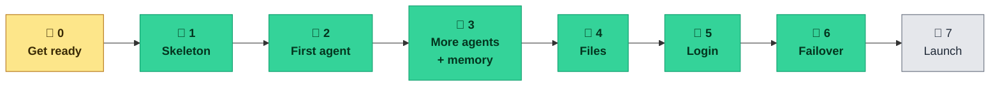
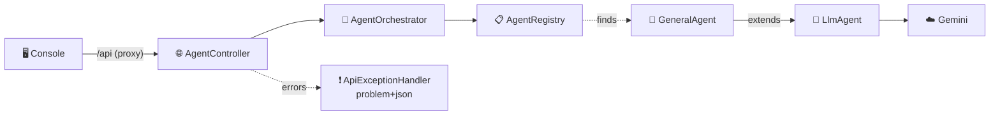
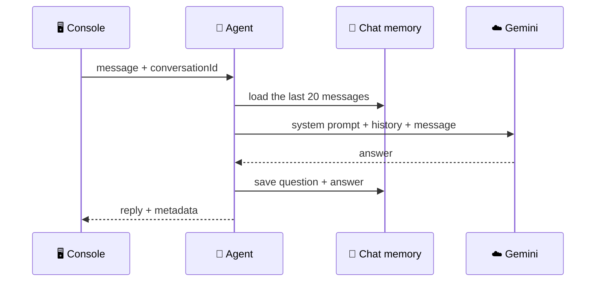
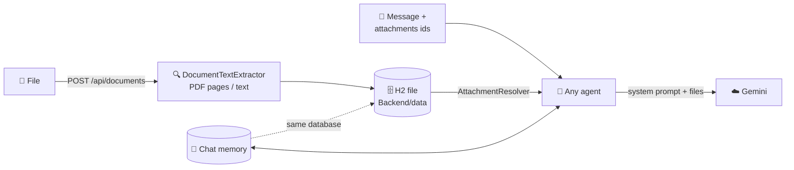
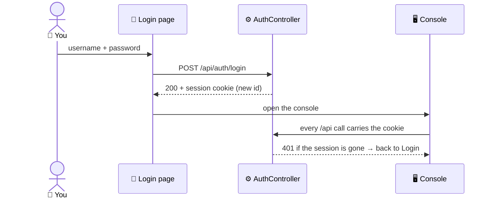
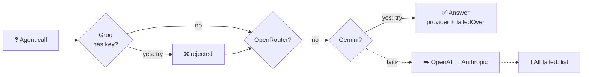

# ✅ Tasks

**Everything left to do on the Multi-Agent AI Platform, in order.**
How to build each backend phase: [`BACKEND.md`](BACKEND.md) · How to run it: [`README.md`](README.md)

---

## 🧭 Where things stand

| | |
|---|---|
| 🖥️ **Frontend** | 🟢 Finished — lint ✅ build ✅, runs on its own with **simulated** replies |
| ⚙️ **Backend** | 🟡 5 agents · **5 AI providers with failover** · uploads · H2 storage · login · Phase 7 to go |
| 🔐 **Login** | 🟢 Real session login · accounts from `AUTH_USERS` in `Backend/.env` (not set yet → one-time `admin` password in the log) |
| 🧪 **Tests** | 🟡 Backend: 132 passing, no key or network needed · Frontend: none |
| 📚 **Docs** | 🟡 Behind the code — `README.md` still says there's no backend, and links to removed or missing files |
| 🔑 **Secrets** | 🟡 New key is in `Backend/.env` · make sure the leaked `…Egng` (`eebf0a8`, on GitHub) is revoked |
| 💾 **Git** | 🟢 Phases 1–6 pushed to `origin/main` · working tree clean |

🔴 not started &nbsp;·&nbsp; 🟡 in progress &nbsp;·&nbsp; 🟢 done

---

## 🗺️ Roadmap

| Phase | Status | Left to do |
|---|---|---|
| 🧹 **0 · Get ready** | 🟡 | Confirm the leaked keys are revoked |
| 🧱 **1 · Skeleton** | 🟢 | — |
| 🤖 **2 · First agent** | 🟢 | — |
| 🧠 **3 · More agents + memory** | 🟢 | — |
| 📎 **4 · Files** | 🟢 | — |
| 🔐 **5 · Login** | 🟢 | — |
| 🔁 **6 · Failover** | 🟢 | — |
| 🚀 **7 · Launch & extras** | 🔴 | Streaming, Docker, CI |

---

## 🔥 Do these next

1. 🔑 **Make sure the leaked keys are revoked** in Google AI Studio (`…Egng` and `…5i5w`).
2. 👤 **Add your account** to `Backend/.env`: `AUTH_USERS=yourname:a-long-password`
3. 🔄 **Restart your backend**: the one running now predates failover.
4. 🚀 **Start Phase 7**: streaming, Docker, CI and the rest.
5. 📚 **Bring `README.md` up to date**: it still says any username and password gets in.

---

## ⚙️ Backend, phase by phase

> File-by-file details for every phase are in [`BACKEND.md`](BACKEND.md). Keep JSON names identical
> to [`Frontend/src/types.ts`](Frontend/src/types.ts).

### 🧹 Phase 0 — Get ready

- [x] ☕ Java 25 installed (Temurin 25.0.3) · 🟩 Node 24 · 🧰 VS Code Java + Spring extensions
- [ ] 🔑 Revoke **both** keys found in the git history, in [AI Studio](https://aistudio.google.com/apikey)

  | Key ending | Found in | Public? |
  |---|---|---|
  | `…Egng` | `eebf0a8` on `main` | 🔴 Yes — on GitHub |
  | `…5i5w` | `6619ece` on local branch `backup-before-scrub` | 🟡 Local only |

- [x] 🆕 Create a new key
- [x] 📝 `Backend/.env` template ready (git ignores it)
- [x] 📋 New key pasted in `Backend/.env` (checked: not one of the leaked keys)

### 🧱 Phase 1 — Skeleton

- [x] 📦 Project generated: Web MVC, Validation, Actuator, Lombok (`cf110e9`)
- [x] 📁 Package folders created: `agent/core` · `agent/llm` · `agent/impl` · `document` · `config` · `web/dto`
  (all filled in Phase 2 except `document/`, which Phase 4 fills)
- [x] ⚙️ `application.properties` filled in (port, `127.0.0.1`, `.env` import, problem+json, health)
- [x] 📄 Create `Backend/.env.example` with empty values
- [x] 🙈 Add `!.env.example` to the root `.gitignore` (its `.env.*` rule hides the example)
- [x] ▶️ `./mvnw spring-boot:run`, then check health through the frontend proxy
- [x] 💾 Committed and pushed: `419fea2`

✅ **Done when** <http://localhost:5173/actuator/health> shows `{"status":"UP"}`. **Checked Oct 10:** 🟢 `UP`

| Check | Result |
|---|---|
| 🩺 Health on `:8080` and through the proxy on `:5173` | 🟢 `{"status":"UP"}` |
| 🔑 `.env` loaded | 🟢 `GEMINI_API_KEY` read from `file [.env]` (value hidden by Spring) |
| ❗ Unknown route, e.g. `/api/agents` | 🟢 `404` as `application/problem+json` |
| 🏠 Listening on | 🟢 `127.0.0.1:8080` only |

> 💡 Start the backend from the `Backend/` folder. The `.env` path is relative to where you run it.

### 🤖 Phase 2 — First agent

- [x] ➕ `pom.xml`: Spring AI BOM `2.0.1` + `spring-ai-starter-model-google-genai`
- [x] ⚙️ Add the Gemini settings to `application.properties` (key from `${GEMINI_API_KEY}`)
- [x] 🧩 `agent/core` — `AgentRequest` · `AgentResponse` · `AgentParameter` · `Agent` · `AgentRegistry` · `AgentOrchestrator` · `UnknownAgentException`
- [x] 🧠 `agent/llm` — `LlmAgent` (also sends `provider`, `model`, `tokens`, `finishReason` for the Inspector)
- [x] 🤖 `agent/impl` — `GeneralAgent`
- [x] ⚙️ `config` — `AiConfig` · `LlmProvider` (warns at startup when no key is set)
- [x] 📦 `web/dto` — `AgentSummary` · `RunAgentRequest` · `RunAgentResponse` · `PlatformStatus`
- [x] 🌐 `web` — `AgentController` · `PlatformController` · `ApiExceptionHandler`
- [x] 🧪 35 tests with a fake AI model (no key, no network) — `./mvnw test` 🟢
- [x] 💾 Committed and pushed: `89279fa` agent core · `57d59ef` Gemini + General Assistant · `f238c88` REST API

✅ **Done when** the sidebar says **Backend online** and the General Assistant answers for real. **Checked Oct 10:** 🟢

| Check (through the frontend proxy) | Result |
|---|---|
| 📋 `GET /api/agents` | 🟢 `200` — the General Assistant, in the shape `types.ts` expects |
| ⚙️ `GET /api/platform` | 🟢 `200` — Google Gemini · `gemini-3.5-flash-lite` · key configured |
| 💬 `POST /api/agents/general/run` | 🟢 Real answer in 1.6 s: *"The capital of France is Paris."* |
| 🔑 Wrong key | 🟢 `502` problem+json: *"Set GEMINI_API_KEY in Backend/.env and restart"* |
| ❓ Unknown agent | 🟢 `404` problem+json with `agentId` |

### 🧠 Phase 3 — More agents + memory

- [x] 🤖 `CodingAgent` (`language` option) · `ResearchAgent` · `SummarizerAgent` (`style`, `maxWords`)
- [x] ⚙️ `PlatformProperties` for `platform.*` settings (`platform.memory.max-messages=20`)
- [x] 🧠 Chat memory bean in `AiConfig` — last 20 messages per conversation, in RAM until Phase 4
- [x] 🔧 `LlmAgent`: memory per `conversationId`, a failed call leaves no unanswered question behind, `attribute()` helpers
- [x] 📊 `/api/platform`: reports the real `memoryMaxMessages` (20)
- [x] 🌐 `ConversationController` — `DELETE /api/conversations/{id}` → `204`
- [x] 🧪 58 tests: every agent's options, memory, forgetting — `./mvnw test` 🟢
- [x] 💾 Committed and pushed: `ce9b0f9` memory · `6ea75a3` forget endpoint · `a7a1660` three agents

✅ **Done when** the Agents page shows four agents and a follow-up question remembers the last one. **Checked Oct 10:** 🟢

| Check (real Gemini, through the frontend proxy) | Result |
|---|---|
| 📋 `GET /api/agents` | 🟢 coding · general · research · summarizer, with their options |
| 🧠 Follow-up question | 🟢 *"My favourite colour is teal"* → *"What is my favourite colour?"* → **Teal** |
| 🗑️ `DELETE /api/conversations/{id}` | 🟢 `204`, then the same question → **unknown** |
| 💻 Coding, `language=Python` / auto-detect | 🟢 Python code · `metadata.language` = `Python` / `rust` |
| 📝 Summarizer, `tldr`, 25 words | 🟢 One sentence · `compressionRatio` 0.35 |
| 🔬 Research | 🟢 Summary / findings format · `confidence` = `high` |

> 🐛 Fixed on the way: the old Research Agent read *"Confidence: medium, not high"* as **high**. It now takes the level
> right after the heading.

- [ ] ✏️ **Known gap:** editing an earlier message in the console drops later turns in the browser only. The server
  still remembers them, so the re-asked question is answered with the old turns as context. Fix later: the console
  could forget and replay the conversation, or send its history with each message.

### 📎 Phase 4 — Files

- [x] ➕ `pom.xml`: `spring-boot-starter-jdbc` · `h2` · `spring-ai-pdf-document-reader` · `spring-ai-starter-model-chat-memory-repository-jdbc`
- [x] 🗄️ `schema.sql` — the documents table (works on H2 and Postgres)
- [x] 📎 `document/` — `StoredDocument` · `DocumentStore` · `JdbcDocumentStore` · `DocumentTextExtractor` · `AttachmentResolver` · `UnsupportedDocumentException` (→ `415`)
- [x] 📦 `DocumentSummary` · 🌐 `DocumentController` — `POST /api/documents` → `201`, `DELETE /api/documents/{id}` → `204`
- [x] 📄 `DocumentAgent` — answers only from attached files; `400` without one (`InvalidAgentRequestException`)
- [x] 📎 **Every** agent reads attached files (in the system prompt, never in memory) and reports `documentNames`
- [x] 📝 Summarizer summarises the attached file, not the short message, when a file is attached
- [x] 🙈 `Backend/data/` in `Backend/.gitignore`
- [x] 📊 `/api/platform` reports real document counts and limits (50 files, 60 000 chars)
- [x] 🧪 89 tests, including the real `schema.sql` on H2 — `./mvnw test` 🟢
- [x] 🔁 Tested a real restart, not just `./mvnw test`
- [x] 💾 Committed and pushed: `d41a0b6` H2 storage · `7b44671` uploads · `633fcd0` files for every agent + Document Agent

> ✂️ **Left out on purpose:** `StorageConfig` and the old in-memory store. There is only one store now, so nothing
> needs choosing; Postgres is a change of `SPRING_DATASOURCE_URL`, not of code. `DocumentNotFoundException` too:
> nothing throws it without a "get one document" endpoint.

✅ **Done when** an answer quotes an attached PDF, and the file is still there after a restart. **Checked Oct 10:** 🟢

| Check (real Gemini, through the frontend proxy) | Result |
|---|---|
| 📤 Upload a 2-page PDF | 🟢 `201` · `pages: 2` · preview with `[page 1]` / `[page 2]` |
| 📄 Document Agent: *"When does the lease renew?"* | 🟢 Quotes page 2: *"renews automatically every 1 May unless cancelled 90 days before"* |
| 🚫 Document Agent with no file | 🟢 `400` *"needs at least one attached file"* |
| 💬 General Assistant with the same file | 🟢 *"Northwind Traders"* · `documentNames: [lease.pdf]` |
| 🖼️ PNG upload · 21 MB upload | 🟢 `415` · `413`, both problem+json |
| 🔁 **Restart the backend** | 🟢 File still stored · rent question answered from it · memory: *"code word?"* → **Falcon** |
| 🗑️ `DELETE /api/documents/{id}` | 🟢 `204`, stored count back to 0 |

- [ ] 🐘 Run once on a real Postgres (set `SPRING_DATASOURCE_URL`); the schema is written for it but only H2 is tested
- [ ] 📏 The `413` message is Spring's *"Maximum upload size exceeded"*; it could name the 20 MB limit

### 🔐 Phase 5 — Login

**Backend**
- [x] ➕ `spring-boot-starter-security` (+ `-test`)
- [x] 🛡️ `SecurityConfig` — every route needs a session, except login, logout and `/actuator/health`
- [x] 🌐 `AuthController` — `POST /api/auth/login` · `POST /api/auth/logout` · `GET /api/auth/me`
- [x] 📦 `LoginRequest` (never prints the password) · `AuthResponse`
- [x] ❗ The `401` uses problem+json too; a wrong username and a wrong password get the same answer
- [x] 👤 Accounts from `AUTH_USERS` (`name:password,…`), BCrypt-hashed on boot; a malformed or repeated entry stops startup
- [x] 🔒 Safer than the old version: **no `admin`/`admin` default** (random one-time password instead), **new session id on
  login** (session fixation), cookie `HttpOnly; SameSite=Strict`, no session opened by rejected calls, 8 h timeout

**Frontend**
- [x] 🔌 Replaced the `TODO` in `App.tsx` with the real login call
- [x] ♻️ Brought back `useAuth.ts`
- [x] 🔄 Stays signed in after a page refresh (`GET /api/auth/me` on load, with a short splash)
- [x] ⏱️ A `401` from any call sends you back to the login page
- [x] 🚪 Account row + **Sign out** button in the Sidebar (name hidden on phones)
- [x] 💬 Login page explains where accounts come from, and says plainly when the backend can't be reached
- [x] 🧪 `./mvnw test` → 110 🟢 · `npm run lint` + `npm run build` 🟢
- [x] 💾 Committed and pushed: `12880ad` backend login · `8e9f564` frontend login

✅ **Done when** `/api/agents` returns `401` before signing in, and everything works after. **Checked Oct 10:** 🟢

| Check (through the frontend proxy, with your real `.env`) | Result |
|---|---|
| 🚫 `/api/agents`, `/api/auth/me` without a session | 🟢 `401` problem+json · no cookie handed out |
| 🔑 Wrong password | 🟢 `401` *"Incorrect username or password."* |
| ✅ Sign in as `admin` with the one-time password from the log | 🟢 `200` · cookie `HttpOnly; SameSite=Strict` |
| 🤖 With the session: agents · a real Gemini run · upload + delete | 🟢 5 agents · *"Ready."* · `201` / `204` |
| 🚪 Sign out, then reuse the old cookie | 🟢 `204`, then `401` |

> ⚠️ **Not checked:** clicking through the login page in a real browser. The API flow, lint and build all pass; give it
> one manual try. Also by design: login needs the backend (no offline bypass), and restarting the backend signs
> everyone out (sessions live in memory).

- [ ] 💬 Chats are stored per **browser**, not per account: two people sharing a browser see each other's chats

### 🔁 Phase 6 — Provider failover

- [x] ➕ OpenAI + Anthropic starters (Groq and OpenRouter use the OpenAI client at their own address)
- [x] 🔗 `ProviderChain` — providers that have a key, in order; on any failure, the next one answers
- [x] 🧯 `ProviderFailure` reads every SDK's errors (Gemini, OpenAI, Anthropic): bad key · busy · unreachable · rejected
- [x] 📦 `ProviderStatus` · `providers[]` in `/api/platform` · `metadata.provider` = who answered · `metadata.failedOver` = who failed first
- [x] ⚙️ One setting: `AI_PROVIDERS` (default `groq,openrouter,google-genai,openai,anthropic`; empty = default)
- [x] 🔑 All keys in `Backend/.env` (`GEMINI_API_KEY`, `GROQ_API_KEY`, `OPENROUTER_API_KEY`, `OPENAI_API_KEY`, `ANTHROPIC_API_KEY`);
  models via `*_MODEL`
- [x] ⚡ Fails over fast: one retry per provider (not Spring AI's default of 10 with growing waits), 60 s timeout
- [x] ❗ All failed → one message listing each provider's problem; none has a key → `503` *"No AI provider configured"*
- [x] 🧪 132 tests, including startup with every key empty and with all five clients built — `./mvnw test` 🟢
- [x] 💾 Committed and pushed: `6440093`

> 🐛 **Found on the way:** Spring AI's per-provider setup refuses to start on an empty key, so a copied `.env.example`
> would have crashed the backend. It is switched off now; `AiConfig` builds a client only for providers that have a key.

🖥️ The frontend already shows the chain in Settings, so no work was needed there.

✅ **Done when** a broken first key fails over to the next provider and the Inspector names it. **Checked Oct 10:** 🟢

| Check (real APIs, with your Gemini key + a fake Groq key) | Result |
|---|---|
| 📋 Startup log and `/api/platform` | 🟢 Groq ✅ → OpenRouter ⏭️ → Gemini ✅ → OpenAI ⏭️ → Anthropic ⏭️ |
| 🔁 Groq rejects the fake key | 🟢 Gemini answers *"Ready."* in 2.8 s · `provider: Google Gemini` · `failedOver: [Groq rejected the key]` |
| 💥 Every key fake | 🟢 `502` *"All AI providers failed"*, listing Groq and Gemini |

> ⚠️ **Not checked for real:** OpenRouter, OpenAI and Anthropic answering, and the default model names for Groq,
> OpenRouter, OpenAI and Anthropic. Only a Gemini key was available; the others were checked to build and to fail
> cleanly. Override a model with `GROQ_MODEL`, `OPENROUTER_MODEL`, `OPENAI_MODEL` or `ANTHROPIC_MODEL`.

- [ ] 🌊 Streaming is not part of the chain yet: Phase 7 needs to add failover to streamed replies too

### 🚀 Phase 7 — Launch & extras

- [ ] 🌊 **Streaming** — `POST /api/agents/{id}/stream` **and** word-by-word rendering in the Playground
- [ ] 🧭 **Auto-pick** the right agent from the message
- [ ] 🌐 **Web search** for the Research Agent
- [ ] 👥 **Accounts in the database**: sign-up, password reset, Google sign-in (the login page shows notices for these today)
- [ ] 🐳 **Docker**: `Dockerfile` + `compose.yaml` with Postgres
- [ ] 🔒 **HTTPS**, `Secure` cookies, rate limits
- [ ] 🤖 **CI**: `.github/workflows/ci.yml` runs backend tests + frontend lint/build on every push

---

## 🖥️ Frontend

Small fixes you can do now, without the backend:

- [x] ✏️ Login error said *"email or username"*; now *"Enter your username and password."*
- [x] 💬 `client.ts` header now lists the real endpoints (auth included) and points to `BACKEND.md`
- [ ] 🔑 The "no API key" hints name `GROQ_API_KEY` as the example. Fine now that Groq is first in the chain, but showing
  `platform.keyEnvVar` would follow `AI_PROVIDERS`
  ([`App.tsx:133`](Frontend/src/App.tsx#L133), [`OverviewPage.tsx:89`](Frontend/src/pages/OverviewPage.tsx#L89))
- [ ] 🧪 Add tests (there are none) — e.g. Vitest for `lib/` and `api/client.ts`
- [ ] 💰 Token and cost totals per chat in the Inspector *(later)*

---

## 📚 Docs & housekeeping

- [x] 📈 `PROGRESS.md` removed (`25f5d71`)
- [ ] 📖 **`README.md` still describes a repo with no backend.** Update it for Phases 2–5:
  - add **how to run the backend**: copy `.env.example` to `.env`, add the key and `AUTH_USERS`, `./mvnw spring-boot:run` from `Backend/`
  - Quick start (line 54) says *any username and password* gets in; Security notes say the login protects nothing
  - the status note (line 19), the *rebuilding* badge (13), the diagram (72), line 127 and the footer (194)
  - Troubleshooting (line 162) still says *"there is no backend yet"*
- [ ] 🔗 Remove the links to `PROGRESS.md` from `README.md` (lines 20, 123, 154, 187) and `BACKEND.md` (footer)
- [ ] 🩺 `README.md` lists `FRONTEND_BUG_AUDIT.md` (lines 124, 189), but that file was never committed
- [ ] 🏷️ `BACKEND.md`: the status badge says *Not started* and every phase is 🔴; mark Phases 0–2
- [ ] 📝 [`Frontend/README.md:175`](Frontend/README.md#L175) says the backend includes Spring Security; it doesn't yet
- [ ] 🧾 `pom.xml`: fill in or delete the empty `<name/>`, `<description/>`, `<licenses>`, `<developers>`, `<scm>`
- [ ] 🌶️ Lombok is in `pom.xml` but no code uses it. On Java 25 it prints `sun.misc.Unsafe` warnings and breaks VS Code's annotation processing, so consider removing it
- [ ] 🗑️ Delete the stray `target/` folder at the repo root (old build output)
- [ ] 🌿 Delete branch `phase-2/foundation` (local + GitHub). It's from the old backend and fully merged into `main`
- [ ] ⚖️ Add a `LICENSE` *(optional)*

---

## 🔒 Before anyone else can reach it

- [ ] 🔑 The leaked key is revoked (see [Do these next](#-do-these-next))
- [ ] 🧹 Delete the local branch `backup-before-scrub`, the only place both leaked keys still sit together
  (`53ec5b2`, `6619ece`). It was never pushed, and deleting it can't be undone
- [ ] 🏠 Keep `server.address=127.0.0.1` until HTTPS works (login is done; passwords still travel unencrypted over plain HTTP)
- [ ] 🔐 HTTPS + `Secure` cookies (Phase 7)
- [ ] 🙈 No keys in `VITE_*` variables; every visitor can see them

---

✅ Task list · last checked against the code on 10 October 2026 · tick boxes as you go

