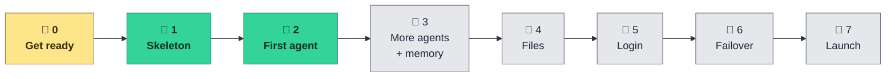
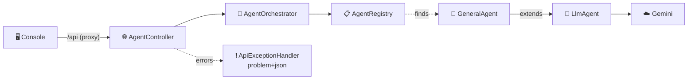

# ✅ Tasks

**Everything left to do on the Multi-Agent AI Platform, in order.**
How to build each backend phase: [`BACKEND.md`](BACKEND.md) · How to run it: [`README.md`](README.md)

---

## 🧭 Where things stand

| | |
|---|---|
| 🖥️ **Frontend** | 🟢 Finished — lint ✅ build ✅, runs on its own with **simulated** replies |
| ⚙️ **Backend** | 🟡 First agent live — the General Assistant answers for real through Gemini · 3 endpoints · Phases 3–7 to go |
| 🔐 **Login** | 🔴 Placeholder — any username and password gets in ([`App.tsx:30`](Frontend/src/App.tsx#L30)) |
| 🧪 **Tests** | 🟡 Backend: 35 passing, no key or network needed · Frontend: none |
| 📚 **Docs** | 🟡 Some links broken — `PROGRESS.md` was removed, `FRONTEND_BUG_AUDIT.md` never existed |
| 🔑 **Secrets** | 🟡 New key is in `Backend/.env` · make sure the leaked `…Egng` (`eebf0a8`, on GitHub) is revoked |

🔴 not started &nbsp;·&nbsp; 🟡 in progress &nbsp;·&nbsp; 🟢 done

---

## 🗺️ Roadmap

| Phase | Status | Left to do |
|---|---|---|
| 🧹 **0 · Get ready** | 🟡 | Confirm the leaked keys are revoked |
| 🧱 **1 · Skeleton** | 🟢 | — |
| 🤖 **2 · First agent** | 🟢 | — |
| 🧠 **3 · More agents + memory** | 🔴 | 3 agents, chat memory |
| 📎 **4 · Files** | 🔴 | Uploads, H2 storage, Document Agent |
| 🔐 **5 · Login** | 🔴 | Spring Security + frontend wiring |
| 🔁 **6 · Failover** | 🔴 | Provider chain |
| 🚀 **7 · Launch & extras** | 🔴 | Streaming, Docker, CI |

---

## 🔥 Do these next

1. 🔑 **Make sure the leaked keys are revoked** in Google AI Studio (`…Egng` and `…5i5w`).
2. 🧠 **Start Phase 3**: three more agents and chat memory.
3. 🔗 **Fix the doc links** to the removed `PROGRESS.md` and the missing `FRONTEND_BUG_AUDIT.md`.

---

## ⚙️ Backend, phase by phase

> File-by-file details for every phase are in [`BACKEND.md`](BACKEND.md). Keep JSON names identical
> to [`Frontend/src/types.ts`](Frontend/src/types.ts).

### 🧹 Phase 0 — Get ready

- [x] ☕ Java 25 installed (Temurin 25.0.3) · 🟩 Node 24 · 🧰 VS Code Java + Spring extensions
- [ ] 🔑 Revoke **both** keys found in the git history, in [AI Studio](https://aistudio.google.com/apikey)

  | Key ending | Found in | Public? |
  |---|---|---|
  | `…Egng` | `eebf0a8` on `main` | 🔴 Yes — on GitHub |
  | `…5i5w` | `6619ece` on local branch `backup-before-scrub` | 🟡 Local only |

- [x] 🆕 Create a new key
- [x] 📝 `Backend/.env` template ready (git ignores it)
- [x] 📋 New key pasted in `Backend/.env` (checked: not one of the leaked keys)

### 🧱 Phase 1 — Skeleton

- [x] 📦 Project generated: Web MVC, Validation, Actuator, Lombok (`cf110e9`)
- [x] 📁 Package folders created: `agent/core` · `agent/llm` · `agent/impl` · `document` · `config` · `web/dto`
  (still empty, so git can't see them yet)
- [x] ⚙️ `application.properties` filled in (port, `127.0.0.1`, `.env` import, problem+json, health)
- [x] 📄 Create `Backend/.env.example` with empty values
- [x] 🙈 Add `!.env.example` to the root `.gitignore` (its `.env.*` rule hides the example)
- [x] ▶️ `./mvnw spring-boot:run`, then check health through the frontend proxy
- [x] 💾 Committed and pushed: `419fea2`

✅ **Done when** <http://localhost:5173/actuator/health> shows `{"status":"UP"}`. **Checked Oct 10:** 🟢 `UP`

| Check | Result |
|---|---|
| 🩺 Health on `:8080` and through the proxy on `:5173` | 🟢 `{"status":"UP"}` |
| 🔑 `.env` loaded | 🟢 `GEMINI_API_KEY` read from `file [.env]` (value hidden by Spring) |
| ❗ Unknown route, e.g. `/api/agents` | 🟢 `404` as `application/problem+json` |
| 🏠 Listening on | 🟢 `127.0.0.1:8080` only |

> 💡 Start the backend from the `Backend/` folder. The `.env` path is relative to where you run it.

### 🤖 Phase 2 — First agent

- [x] ➕ `pom.xml`: Spring AI BOM `2.0.1` + `spring-ai-starter-model-google-genai`
- [x] ⚙️ Add the Gemini settings to `application.properties` (key from `${GEMINI_API_KEY}`)
- [x] 🧩 `agent/core` — `AgentRequest` · `AgentResponse` · `AgentParameter` · `Agent` · `AgentRegistry` · `AgentOrchestrator` · `UnknownAgentException`
- [x] 🧠 `agent/llm` — `LlmAgent` (also sends `provider`, `model`, `tokens`, `finishReason` for the Inspector)
- [x] 🤖 `agent/impl` — `GeneralAgent`
- [x] ⚙️ `config` — `AiConfig` · `LlmProvider` (warns at startup when no key is set)
- [x] 📦 `web/dto` — `AgentSummary` · `RunAgentRequest` · `RunAgentResponse` · `PlatformStatus`
- [x] 🌐 `web` — `AgentController` · `PlatformController` · `ApiExceptionHandler`
- [x] 🧪 35 tests with a fake AI model (no key, no network) — `./mvnw test` 🟢
- [x] 💾 Committed and pushed: `89279fa` agent core · `57d59ef` Gemini + General Assistant · `f238c88` REST API

✅ **Done when** the sidebar says **Backend online** and the General Assistant answers for real. **Checked Oct 10:** 🟢

| Check (through the frontend proxy) | Result |
|---|---|
| 📋 `GET /api/agents` | 🟢 `200` — the General Assistant, in the shape `types.ts` expects |
| ⚙️ `GET /api/platform` | 🟢 `200` — Google Gemini · `gemini-3.5-flash-lite` · key configured |
| 💬 `POST /api/agents/general/run` | 🟢 Real answer in 1.6 s: *"The capital of France is Paris."* |
| 🔑 Wrong key | 🟢 `502` problem+json: *"Set GEMINI_API_KEY in Backend/.env and restart"* |
| ❓ Unknown agent | 🟢 `404` problem+json with `agentId` |

### 🧠 Phase 3 — More agents + memory

- [ ] 🤖 `CodingAgent` (`language` option) · `ResearchAgent` · `SummarizerAgent` (`style`, `maxWords`)
- [ ] ⚙️ `PlatformProperties` for `platform.*` settings
- [ ] 🧠 Chat memory bean in `AiConfig` — last 20 messages per conversation
- [ ] 🔧 `LlmAgent`: attach memory per `conversationId`, add `attribute()` helpers for agent options
- [ ] 📊 `/api/platform`: report the real `memoryMaxMessages` (it says `0` today)
- [ ] 🌐 `ConversationController` — `DELETE /api/conversations/{id}`
- [ ] 🧪 Tests for each agent's options and for memory

✅ **Done when** the Agents page shows four agents and a follow-up question remembers the last one.

### 📎 Phase 4 — Files

- [ ] ➕ `pom.xml`: `spring-boot-starter-jdbc` · `h2` · `spring-ai-pdf-document-reader` · `spring-ai-starter-model-chat-memory-repository-jdbc`
- [ ] 🗄️ `schema.sql` — the documents table
- [ ] 📎 `document/` — `StoredDocument` · `DocumentStore` · `JdbcDocumentStore` · `DocumentTextExtractor` · `AttachmentResolver` · 2 exceptions
- [ ] ⚙️ `StorageConfig` · 📦 `DocumentSummary` · 🌐 `DocumentController`
- [ ] 📄 `DocumentAgent` — answers only from attached files
- [ ] 🙈 Add `data/` to `Backend/.gitignore`
- [ ] 📊 `/api/platform`: report real document counts (all `0` today)
- [ ] 🔁 Test a real restart, not just `./mvnw test`

✅ **Done when** an answer quotes an attached PDF, and the file is still there after a restart.

### 🔐 Phase 5 — Login

**Backend**
- [ ] ➕ `spring-boot-starter-security`
- [ ] 🛡️ `SecurityConfig` — every route needs a session, except login
- [ ] 🌐 `AuthController` — `POST /api/auth/login` · `POST /api/auth/logout` · `GET /api/auth/me`
- [ ] 📦 `LoginRequest` · `AuthResponse`
- [ ] ❗ The `401` uses problem+json too

**Frontend**
- [ ] 🔌 Replace the `TODO` in [`App.tsx:30`](Frontend/src/App.tsx#L30) with the real login call
- [ ] ♻️ Bring back `useAuth.ts`: `git show 434d0ed^:Frontend/src/hooks/useAuth.ts`
- [ ] 🔄 Stay signed in after a page refresh (`GET /api/auth/me` on load)
- [ ] ⏱️ A `401` from any call sends you back to the login page
- [ ] 🚪 Account row + **Sign out** button in the Sidebar

✅ **Done when** `/api/agents` returns `401` before signing in, and everything works after.

### 🔁 Phase 6 — Provider failover

- [ ] ➕ OpenAI + Anthropic starters (Groq and OpenRouter reuse the OpenAI one)
- [ ] 🔗 `ProviderChain` — providers that have a key, in order; on failure, try the next one
- [ ] 📦 `ProviderStatus` · add `providers[]` to `PlatformStatus` · `metadata.provider` = the provider that actually answered
  (Phase 2 already sends `metadata.provider`; it's always Gemini today)
- [ ] ⚙️ One setting: `AI_PROVIDERS=groq,openrouter,google-genai,openai,anthropic`

🖥️ The frontend already shows the chain in Settings, so no work is needed there.

✅ **Done when** a broken first key fails over to the next provider and the Inspector names it.

### 🚀 Phase 7 — Launch & extras

- [ ] 🌊 **Streaming** — `POST /api/agents/{id}/stream` **and** word-by-word rendering in the Playground
- [ ] 🧭 **Auto-pick** the right agent from the message
- [ ] 🌐 **Web search** for the Research Agent
- [ ] 👥 **Accounts in the database**: sign-up, password reset, Google sign-in (the login page shows notices for these today)
- [ ] 🐳 **Docker**: `Dockerfile` + `compose.yaml` with Postgres
- [ ] 🔒 **HTTPS**, `Secure` cookies, rate limits
- [ ] 🤖 **CI**: `.github/workflows/ci.yml` runs backend tests + frontend lint/build on every push

---

## 🖥️ Frontend

Small fixes you can do now, without the backend:

- [ ] ✏️ Login error says *"email or username"*; there are no emails ([`LoginPage.tsx:157`](Frontend/src/pages/LoginPage.tsx#L157))
- [ ] 💬 [`client.ts:7`](Frontend/src/api/client.ts#L7) points to a `Backend/README.md` that doesn't exist, and lists
  `GET /api/documents`, which nothing calls
- [ ] 🧪 Add tests (there are none) — e.g. Vitest for `lib/` and `api/client.ts`
- [ ] 💰 Token and cost totals per chat in the Inspector *(later)*

---

## 📚 Docs & housekeeping

- [x] 📈 `PROGRESS.md` removed (`25f5d71`)
- [ ] 🔗 Remove the links to it from `README.md` (lines 20, 123, 154, 187) and `BACKEND.md` (footer)
- [ ] 🩺 `README.md` lists `FRONTEND_BUG_AUDIT.md`, but that file was never committed. Remove the row and the layout line.
- [ ] 📝 [`Frontend/README.md:175`](Frontend/README.md#L175) says the backend includes Spring Security; it doesn't yet
- [ ] 🏷️ Update the badges as phases land (README *Backend: rebuilding*, BACKEND.md *Status: Not started*)
- [ ] 🧾 `pom.xml`: fill in or delete the empty `<name/>`, `<description/>`, `<licenses>`, `<developers>`, `<scm>`
- [ ] 🌶️ Lombok is in `pom.xml` but no code uses it. On Java 25 it prints `sun.misc.Unsafe` warnings and breaks VS Code's annotation processing, so consider removing it
- [ ] 🗑️ Delete the stray `target/` folder at the repo root (old build output)
- [ ] ⚖️ Add a `LICENSE` *(optional)*

---

## 🔒 Before anyone else can reach it

- [ ] 🔑 The leaked key is revoked (see [Do these next](#-do-these-next))
- [ ] 🏠 Keep `server.address=127.0.0.1` until Phase 5 login works
- [ ] 🔐 HTTPS + `Secure` cookies (Phase 7)
- [ ] 🙈 No keys in `VITE_*` variables; every visitor can see them

---

✅ Task list · last checked against the code on 10 October 2026 · tick boxes as you go

